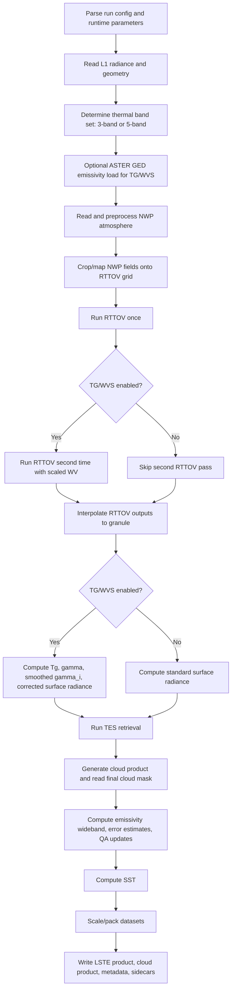
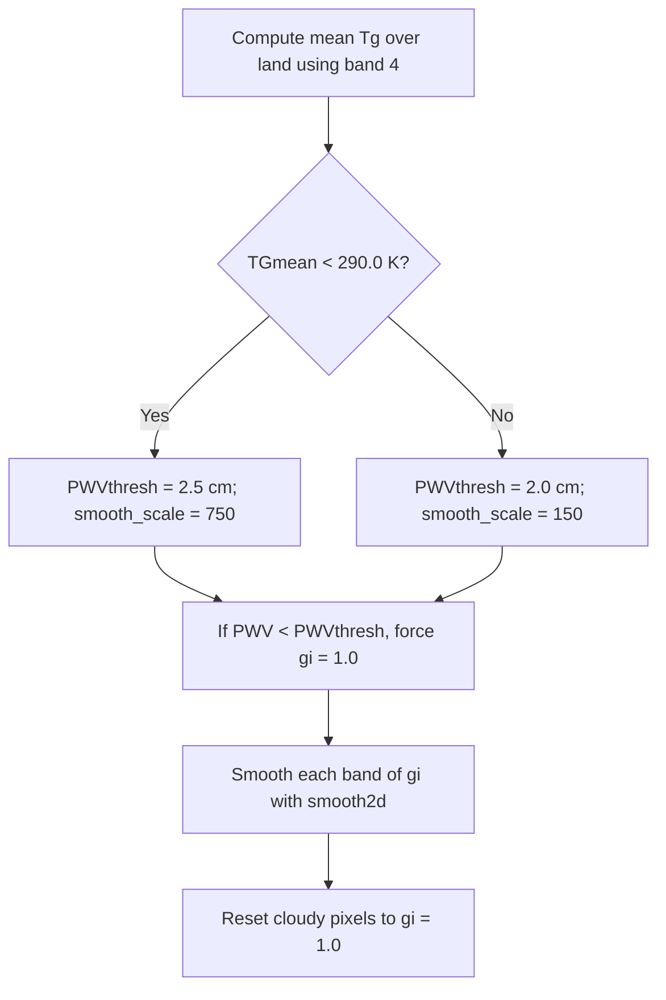
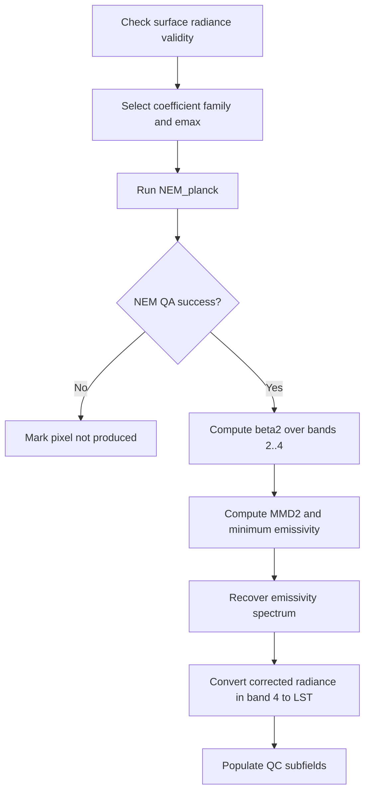

# Integrated Operational & Institutional Product Algorithm Specification Document: Land Surface Temperature & Emissivity (LSTE) Processing Pipeline

## Document Metadata

* **Core Software Pipeline Version:** 3.0.3 (ECOSTRESS / NPP SIPS Framework / `src/tes_main.c`)
* **Classification:** Open Science Processing Software Specification
* **Document Version:** 3.0 (Consolidated Operational Architecture)
* **Document Purpose:** Language-independent, deterministic blueprint combining abstract physical formulations with low-level C implementation details to ensure exact binary replication across heterogeneous computing environments.

---

## 1. Pipeline Architecture & High-Level Control Flow

The LSTE pipeline operates as a modular data processing network, executing sequential multi-spectral matrix transformations over observed top-of-atmosphere (TOA) thermal infrared radiances to isolate thermodynamic skin components from atmospheric attenuation. The combined file logic manages product orchestration (configuration, metadata, output formatting), the physical workflow (NWP preparation, RTTOV execution, TG/WVS correction, TES retrieval), and product augmentation (cloud masks, SST, uncertainty estimates, QA flags).

### 1.1 Structural Module Decomposition

A functional implementation must isolate components into distinct programmatic modules to ensure testing boundary containment:

* **Config Loader Module:** Decodes runtime process parameters, file naming conventions, and runtime properties from XML frameworks.
* **L1 Reader Ingestion Interface:** Parses raw unscaled radiance tracks, data quality attributes, and sensor look-geometries across varying data layouts (HDF4, HDF5, NetCDF).
* **NWP Adapter Normalization Block:** Adapts non-uniform weather models, handles data clamping constraints, and implements vertical water path fallback integrals.
* **RTTOV Interface Engine:** Formats profiles into linear binary streams and executes clear-sky simulations via specialized shell commands.
* **LUT Service Table Resolver:** Handles coordinate linear interpolations over non-uniform sensor calibration data arrays for temperature-radiance conversions.
* **TG/WVS Modulating Scaler:** Resolves horizontal atmospheric water vapor paths, implements multi-pass smoothing, and isolates surface-leaving intensities.
* **TES Kernel Separation Engine:** Executes iterative Planck corrections, relative emissivity scaling, and empirical minimum-emissivity curve fitting.
* **Cloud Integration & Flagging Matrix:** Dynamically updates 16-bit uncertainty tracking variables, computes summary metrics, and processes scanner data anomalies.
* **SST Split-Window Block:** Processes localized regressions over geolocated pixels independent of the surface type mask.
* **Product Writer Packing Node:** Quantizes floating-point outputs into standardized structural formats, adding HDF-EOS metadata and sidecar files.

### 1.2 High-Level Pipeline Flowchart

### 1.3 Core Data and State Tensors

The central data arrays span active channels ($b$), rows ($r$ or line), and columns ($c$ or pixel):

| Tensor Variable | Scientific Meaning / Role | Memory Layout / Dimensions |
| --- | --- | --- |
| `Y[b, r, c]` | Observed TOA Radiance from L1 product | `[n_channels, n_lines, n_pixels]` |
| `t1r[b, r, c]` | Atmospheric Transmittance from unscaled Pass 1 | `[n_channels, n_lines, n_pixels]` |
| `t2r[b, r, c]` | Atmospheric Transmittance from scaled Pass 2 | `[n_channels, n_lines, n_pixels]` (Optional) |
| `pathr[b, r, c]` | Upwelling Atmospheric Path Radiance | `[n_channels, n_lines, n_pixels]` |
| `skyr[b, r, c]` | Downwelling Reflected Sky Radiance | `[n_channels, n_lines, n_pixels]` |
| `pwv[r, c]` | Mapped Total Column / Precipitable Water Vapor | `[n_lines, n_pixels]` |
| `surfradi[b, r, c]` | Surface-leaving Radiance after atmospheric correction | `[n_channels, n_lines, n_pixels]` |
| `Tg[b, r, c]` | TG/WVS Brightness Temperature Surrogate | `[n_channels, n_lines, n_pixels]` |
| `g[b, r, c]` | Unfiltered Moisture Scaling Gamma Factor | `[n_channels, n_lines, n_pixels]` |
| `gi[b, r, c]` | Smoothed Gamma Filter Field for blending runs | `[n_channels, n_lines, n_pixels]` |
| `Ts[r, c]` | Evaluated Land Surface Temperature (LST) | `[n_lines, n_pixels]` |
| `emisf[b, r, c]` | Decoupled Narrowband Surface Emissivity Spectra | `[n_channels, n_lines, n_pixels]` |
| `QC[r, c]` | Unified 16-Bit Quality Control Flags Field | `[n_lines, n_pixels]` |

---

## 2. Dynamic Spectral Band Conventions

The pipeline dynamically configures internal matrix pointers and operational layouts based on instrument configuration metadata parsed from the input radiance layers. If the layout reports anything other than 3 or 5 active bands, the pipeline defaults to 3-band processing.

| Attribute Dimension | 5-Channel Mode Alignment | 3-Channel Mode Alignment |
| --- | --- | --- |
| **Active Instrument Bands** | Bands 1, 2, 3, 4, 5 | Bands 2, 4, 5 |
| **Processing Vector `band[]**` | `[0, 1, 2, 3, 4]` | `[1, 3, 4]` |
| **Reverse Mapping `band_index[]**` | `[0, 1, 2, 3, 4]` | `[-1, 0, -1, 1, 2]` |
| **Reference Thermal Index** | Index 3 (Physical Band 4) | Index 1 (Physical Band 4) |

> **Implementation Note:** The internal compact index $b = 0 \dots n\_channels-1$ maps back to the physical sensor band number minus one via `band[]`. The TES kernel maps the temperature-driving channel to `lst_band_index = band_index[BAND_4]`. Band 4 serves as the continuous reference track for temperature derivations.

---

## 3. Mathematical Infrastructure and Primitive Utility Functions

### 3.1 Piecewise Linear 1D Interpolation over Non-Uniform Spacing (`interp1d_npts`)

Used for physical mapping inversions (such as inverting Planck functions or mapping sensor radiances), this function evaluates an independent query target against non-uniformly spaced lookup vector coordinates using a deterministic binary search tree.

Given an array of independent sample points $X = [x_0, x_1, \dots, x_{N-1}]$ sorted in strict monotonic order, a matching array of dependent coordinates $Y = [y_0, y_1, \dots, y_{N-1}]$, and a target query coordinate $x_q$:

1. **Orientation Check:** If $x_{N-1} < x_0$, the lookup framework is *descending*. If $x_{N-1} > x_0$, it is *ascending*.
2. **Boundary Clamping:**
* For **ascending** vectors: If $x_q \le x_0$, set the baseline index $k = 0$. If $x_q \ge x_{N-1}$, set $k = N - 2$.
* For **descending** vectors: If $x_q \ge x_0$, set the baseline index $k = 0$. If $x_q \le x_{N-1}$, set $k = N - 2$.

3. **Binary Search Traversal:** For any query falling within the remaining interior domain, execute a strict binary search to locate the boundary interval index $k$ such that:
* $\text{Ascending: } x_k \le x_q \le x_{k+1}$
* $\text{Descending: } x_k \ge x_q \ge x_{k+1}$

4. **Linear Evaluation:** Compute the segment slope ($m$) and intercept ($b$) to calculate the final interpolated scalar result $y_q$:

$$m = \frac{y_{k+1} - y_k}{x_{k+1} - x_k}$$

$$b = y_{k+1} - m \cdot x_{k+1}$$

$$y_q = m \cdot x_q + b$$

### 3.2 Streaming 2D Mean Filter Optimization (`smooth2d`)

Spatial filtering of multi-channel moisture scale parameters ($\gamma$) prevents high-frequency pixel noise from creating artifact boundaries in final data layers. This module optimizes performance by tracking running row and column updates to constrain runtime complexity to $O(\text{nrows} \cdot \text{ncols} \cdot 2)$, avoiding sliding-window slowdowns.

For a target matrix $M$ of dimensions $R \times C$, with horizontal and vertical filtering radii designated as $N_r$ and $N_c$, the boundary evaluation window expands to $(2N_r + 1) \times (2N_c + 1)$. The logic must strictly follow these constraints:

1. **NaN Isolation:** Any entry initialized to a Not-a-Number flag ($NaN$) must be omitted from all localized moving summary pools.
2. **State Protection:** If an active index $M(r, c)$ evaluates to $NaN$, or if the localized coordinate window contains exclusively $NaN$ values, the pixel assignment must directly preserve the $NaN$ state into the output matrix.
3. **Streaming Vector Updates:** Track column structures using an array of `SmoothingCol` structures maintaining a running `total` and active `count`. Shift execution windows sequentially by adding the leading boundary row/column elements and subtracting trailing edge parameters.

### 3.3 Spherical Distance Tracking (`distance`)

Distance queries between coordinates utilize a double-precision Haversine equation to account for planetary curvature:

$$\Delta \phi = \text{lat}_2 - \text{lat}_1, \quad \Delta \lambda = \text{lon}_2 - \text{lon}_1$$

$$a = \sin^2\left(\frac{\Delta \phi}{2}\right) + \cos(\text{lat}_1) \cdot \cos(\text{lat}_2) \cdot \sin^2\left(\frac{\Delta \lambda}{2}\right)$$

$$d = 2 \cdot R_{\text{earth}} \cdot \text{atan2}\left(\sqrt{a}, \sqrt{1 - a}\right)$$

Where the planetary radius constant is defined as $R_{\text{earth}} = 6371229.0\text{ m}$.

---

## 4. Global Science Primitives & Constant Coefficients

### 4.1 Numerical and Physics Constraints

* **Equivalence Tolerance ($\epsilon$):** $1.0 \times 10^{-9}$ (Threshold for absolute floating-point evaluations)
* **Temperature Hard Bounds ($T_{min}, T_{max}$):** 150.0 K, 380.0 K (Boundary cutoffs for validity)
* **Vegetation Max Emissivity Base ($e_{max, veg}$):** 0.985
* **Bare Rock/Soil Max Emissivity Base ($e_{max, bare}$):** 0.970
* **WVS Exponent Modifiers ($g_1, g_2$):** 1.0, 0.7
* **Planck Constant Vectors:** $c_1 = 3.7418 \times 10^{-22}\text{ W}\cdot\text{m}^2$, $c_2 = 0.014388\text{ m}\cdot\text{K}$
* **Band Model Calibration Vector ($W_{bmp}$):**

$$W_{bmp} = [1.2818, 1.5693, 1.6595, 1.8217, 1.8031]$$

### 4.2 Regression Parameter Arrays

* **Wide-Band Emissivity Linear Regression Weights ($\alpha_{wb}$):**

$$\alpha_{wb} = [0.0715, 0.0657, 0.1970, 0.3384, 0.3703, -0.0443]$$

* **Emissivity Uncertainty Error Grid Coefficients ($X_e$ matrix of dimensions $5 \times 3$):**
$$X_e = \begin{bmatrix}
0.0153 &  0.0155 & -0.0018 \
0.0121 &  0.0055 &  0.0004 \
0.0128 &  0.0036 &  0.0009 \
0.0110 &  0.0017 &  0.0005 \
0.0114 & -0.0038 &  0.0025
\end{bmatrix}$$
* **Land Surface Temperature Error Estimation Weights ($X_t$ vector):**

$$X_t = [0.3842, 0.5307, 0.0055]$$

---

## 5. Comprehensive Stage-by-Stage Operational Specification

### Stage 1: Runtime Configuration and Parameter Loading

To reproduce the configuration stage, begin by parsing the XML run configuration file passed via the execution command argument. Next, parse `PgeRunParameters.xml` from the configured Operational Support Product (OSP) location and stop immediately if its `PGEVersion` does not exactly evaluate to the compiled constant `PGE_VERSION` (`"3.0.3"`).

After the two XML files are loaded, extract configuration variables including `NWP_DIR`, `L2_OSP_DIR`, `ProductPath`, `ProductCounter`, input filenames, `OrbitNumber`, and `SceneID`. Load the runtime parameter tunables (emissivity coefficients, TG/WVS thresholds, smoothing scales, RTTOV script paths, and LUT filenames), defaulting to hard-coded baselines whenever a parameter block is absent. Capture system environment signatures using Unix pipe utilities (`date -u` for processing timestamps, and `uname -a` to flag the physical processing cluster architecture). Finally, derive the output product filenames from the orbit number, scene ID, timestamp embedded in the radiance filename, and product counter.

### Stage 2: Spectral Band Set Selection

Inspect the input radiance layer header parameters via custom file interfaces. If the file specifies any architecture layout other than 3 or 5 operational channels, drop down to the 3-band configuration mode. In 3-band mode, configure internal loops to process exclusively thermal bands 2, 4, and 5, loading different coefficient sets and selecting a distinct RTTOV wrapper script tailored to the restricted band count. Assign the temperature-driving index configuration string: `lst_band_index = band_index[BAND_4]`.

### Stage 3: L1 Radiance Ingest and Spatial Grid Boundary Mapping

Initialize the internal core sensor metadata structure (`RAD`) and read the raw multi-spectral channel radiances. For system legacy configurations flagged as Collection 2, parse tracking views, terrain, and geometry coordinates out of a separate geolocation dataset (`L1B_GEO`).

Construct the central double-precision radiance data tensor $Y[b, r, c]$ with shape `[n_channels, n_lines, n_pixels]`, copying each band image into its corresponding plane in processing order. Scan the array structure and convert any pixel tracking a radiance value below $0.0\text{ W}\cdot\text{m}^{-2}\cdot\text{sr}^{-1}\cdot\mu\text{m}^{-1}$ to a standard double-precision Not-a-Number flag ($NaN$). Concurrently, interrogate the spatial latitude and longitude grids to track extreme limits ($\text{minLat}, \text{maxLat}, \text{minLon}, \text{maxLon}$). This bounding coordinate envelope establishes the geographic clipping template for the subsequent NWP ingestion step.

### Stage 4: Optional ASTER GED Land Surface Baseline Referencing

If Water Vapor Scaling logic is globally active (`RunTgWvs = true`), pass the granule footprint coordinates, a water mask, and a zero-filled snow/water-index placeholder into the auxiliary ASTER data loader module (`read_aster_ged`) with parameters `adjust_aster = false` and `sensor_type = ECOSTRESS`.

Project the $1^\circ \times 1^\circ$ land grids to match the target scene layout, outputting a continuous 2D surface matrix layer variable `emis_aster[line, pixel]`. Assign ocean pixels a fixed water-surface emissivity constant (0.990) and replace land-surface $NaN$ grid gaps with a standard nominal background value (0.962). If `RunTgWvs` is flagged as false, omit the subgrid queries entirely to conserve system execution paths.

### Stage 5: Ingestion & Normalization of NWP Meteorological Profiles

Identify the meteorological file structure type by inspecting the path string contained in `NWP_DIR` for key identifiers (`MERRA`, `GEOS`, `NCEP`, or `ECMWF`).

* **MERRA:** Extract multi-layer absolute variables directly. Apply physical data clamps to vertical tracking elements ($T$, $Q$, $SP$) and invert the raw pressure level indexing order to conform to the top-to-bottom requirements of the forward radiative transfer model.
* **GEOS:** Read the pre-cropped spatial weather variables. Record absolute input file pathways inside the global metadata tracking parameters and invert the pressure levels to match forward transfer formats.
* **NCEP:** Parse the standard spatial meteorology matrix. Expand the horizontal grid resolution profile to double resolution by running multi-set bilinear spatial interpolation functions over the data layers while preserving the native vertical pressure indexing order.
* **ECMWF:** Not operational; the code triggers an explicit failure path and exits.

#### Humidity Matrix Inversion

If the weather archive provides moisture profiles $Q_{profile}$ formatted as Relative Humidity ($RH$), translate the values into an absolute mass mixing ratio ($w_{mr}$) over liquid supercooled water via the Murphy and Koop (2005) formulation:

$$\ln(e_s) = 54.842763 - \frac{6763.22}{T} - 4.210 \ln(T) + 0.000367 T + \tanh(0.0415(T - 218.8)) \cdot \left(53.878 - \frac{1331.22}{T} - 9.44523 \ln(T) + 0.014025 T\right)$$

$$e = \frac{RH}{100.0} \cdot e_s$$

$$w_{mr} = \left(\frac{e}{P_{levels} - e}\right) \cdot \frac{18.0152}{28.9644}$$

#### Total Column Water Fallback Integration

If the weather data format completely lacks explicit precipitable water tracks, execute numerical trapezoidal integration across adjacent vertical layers where localized pressures map below the true surface pressure limit:

1. Convert PPMV humidity to g/kg via:

$$k_{\mathrm{ppmv\to g/kg}} = \frac{1}{1000 \cdot (28.966 / 18.015)}$$

2. Evaluate the integrated total columnar water content:

$$\text{TCW} = \frac{\sum dq \cdot dp \cdot k_{\mathrm{ppmv\to g/kg}}}{100 \cdot 9.8} = \frac{1.0}{100.0 \cdot 9.8} \sum_{z=0}^{Z_{\text{surf}}-2} \left[ \frac{q_z + q_{z+1}}{2.0} \cdot \left(\frac{18.0152}{28.9644 \cdot 1000.0}\right) \cdot (P_{z+1} - P_z) \right]$$

### Stage 6: Structural Forward Model Input Synthesis

1. Convert discrete atmospheric `lat` and `lon` vectors into 2D meshgrids.
2. Clip the weather fields to match the active scene domain. For GEOS datasets, the pre-cropped domain is directly preserved; for non-GEOS datasets, constrain bounds to the geographic scene extrema plus an extra spatial padding margin of $\pm 2.0^\circ$ in both latitude and longitude.
3. Slice the weather profile states into cropped data arrays (`cropT`, `cropQ`, `cropSP`, `cropTCW`, and optional `cropskt`, `cropt2`, `cropq2`).
4. Project satellite look geometries using nearest-neighbor coordinate mapping from the fine satellite tracks onto the coarse weather subgrid to extract localized surface terrain elevations (`cropHsurf`) and view zeniths (`cropSatZen`).
5. Select the surface skin temperature tracker ($T_{\text{skin}}$): Ingest the explicit weather surface skin temperature layer (`cropskt`) if present; otherwise, substitute the data array from the lowest vertical atmospheric temperature profile level.
6. Initialize the background surface emissivity placeholder matrix (`Bemis`) as a static array filled entirely with the constant value $1.0 \times 10^{-6}$ across all dimensions. The program does not pass physically varying emissivity fields into RTTOV at this stage.

### Stage 7: Profile Stream Flattening and Validation

Reshape the cropped weather data structures into continuous, unrolled arrays configured for the binary interface parameters of the forward radiative model script via the `set_rttov_atmos` routine.

* **Validation and Data Repair Rules:**
* Repair negative or missing vertical profiles: If a temperature value drops below zero or equals the data error code ($0.0001\text{ K}$), override the entry using the global spatial mean calculated across valid profile segments.
* If a skin temperature element ($TSurf\_skt$) drops below the absolute low boundary threshold (90 K), overwrite the entry using the valid grid temperature mean, clamping to ensure it never drops below 90 K.
* If near-surface moisture elements report missing values or zeros where RTTOV requires positivity, pull data from the lowest valid positive level in the vertical humidity profile.
* Derive `t2` and `q2` if not explicitly supplied, transposing arrays into the memory order expected by the legacy MATLAB/RTTOV interface.

* Apply a modulo mapping step ($\text{lon} \leftarrow \text{fmod}(\text{lon} + 360.0, 360.0)$) to transform longitudes into a $[0^\circ, 360^\circ)$ coordinate system. This transformation must execute *exclusively* during the initial binary profile stream construction pass (`prof_in.bin`).

### Stage 8: Forward Simulation Execution Loop

The system executes the forward radiative transfer engine script using a dual-pass simulation loop:

1. **Pass 1 Simulation (`wvs_case = 0`):** Write the baseline unscaled binary profile `prof_in.bin`. Invoke the configured shell wrapper execution call (`script exe coef`) and read the resulting forward calculations from disk (`rad_out.dat`).
2. **Pass 2 Simulation (`wvs_case = 1`):** Executed only if TG/WVS is enabled. Re-scale the humidity profiles across all dimensions (the full 3D profile $Q$, the flattened profile $Qt$, and the surface humidity $Q2$) by a strict factor of 0.7:

$$Q_{\text{scaled}} = Q \cdot 0.7$$

Export this humidity-suppressed dataset to `prof_in.bin` and run the simulation wrapper script a second time to output the updated `rad_out.dat` text dataset.

### Stage 9: Swath Geolocation Remapping & Atmospheric Lookup Synthesis

Parse the text data streams (`rad_out.dat`) generated during the simulation passes. `read_interp_rttov` converts internal wavenumber results into pure micrometer radiance tracking fields ($\text{mW}\cdot\text{m}^{-2}\cdot\text{sr}^{-1}\cdot\mu\text{m}^{-1}$) by running continuous piecewise linear interpolations over a radiance-conversion lookup table.

Map the coarse simulation grid outputs onto the fine satellite swath tracks by running multi-set bilinear interpolation functions (`multi_interp2`). This isolates the pixel-level spatial matrices: $t_{1r}$ (Pass 1 transmittance), $t_{2r}$ (Pass 2 transmittance, if active), $path_r$ (upwelling atmospheric path radiance), $sky_r$ (downwelling reflected sky radiance), and the scene precipitable water vapor grid (`pwv`). If no pixel maps to a positive Pass 1 transmittance, flag the track as unusable and terminate processing early.

### Stage 10: Radiative Calibration Lookup Ingestion

Read the static 6-column multi-spectral radiance-to-temperature calibration file (`rad_lut_file`) into memory. Stop execution if the lookup matrix contains fewer than two distinct row records, as this violates boundary conditions for numeric interpolation stability.

| LUT Column Index | Operational Structural Parameter Meaning |
| --- | --- |
| `lut[0]` | Brightness Temperature Grid Boundaries (K) |
| `lut[1]` | Radiance Profile for Thermal Band 1 |
| `lut[2]` | Radiance Profile for Thermal Band 2 |
| `lut[3]` | Radiance Profile for Thermal Band 3 |
| `lut[4]` | Radiance Profile for Thermal Band 4 |
| `lut[5]` | Radiance Profile for Thermal Band 5 |

This matrix is maintained in memory as an indexed array to optimize continuous piecewise search requests within the primary solver loops, including Planck inversions, blackbody transformations, and SST regressions.

### Stage 11: Atmospheric and Moisture Attenuation Correction

#### 11A. Standard Atmospheric Inversion Path (No WVS)

If WVS processing flags are disabled, calculate the surface-leaving radiances ($surfradi$) directly from the Pass 1 forward model parameters across all coordinates:

$$surfradi[b, r, c] = \frac{Y[b, r, c] - pathr[b, r, c]}{t1r[b, r, c]}$$

#### 11B. Water Vapor Scaling (WVS) Correction Path

If WVS operations are active, resolve moisture variations across the spatial grids using an empirical dual-pass optimization loop:

1. **Compute $Tg$:** Invoke the external sub-module `tg_wvs` to calculate surrogate surface brightness temperatures ($Tg$) using observed radiances $Y$, precipitable water vapor (`pwv`), satellite zenith look angles (`Satzen`), day/night flags, WVS coefficients, and the baseline ASTER-GED array layer (`emis_aster`).
2. **Convert $Tg$ to Blackbody Radiance:** Map the extracted $Tg$ fields into equivalent blackbody-leaving radiances ($B$) via linear lookup interpolation against the calibration table:

$$B = \text{interp}( \text{temperature} = Tg \rightarrow \text{band radiance} )$$

3. **Compute Raw Moisture Scaling Gamma Factors:** For each individual band channel, evaluate the raw parameter matrix ($g$). Let $g_f = g_2^{W_{bmp}[band[b]]}$, where $g_2 = 0.7$ and $W_{bmp}$ represents the band model parameters.

$$\text{term1} = \frac{t2r}{t1r^{g_f}}, \quad \text{term2t} = \frac{B - \frac{pathr}{1.0 - t1r}}{Y - \frac{pathr}{1.0 - t1r}}, \quad \text{term3} = \frac{t2r}{t1r}$$

If any pixel maps to a non-positive or undefined $NaN$ state for variable $\text{term2t}$ within any band, invalidate the entire coordinate column index across all processing dimensions. Calculate:

$$\text{term2} = \text{term2t}^{(g_1 - g_f)} \quad (\text{where } g_1 = 1.0)$$

$$g = \frac{\ln(\text{term1} \cdot \text{term2})}{\ln(\text{term3})}$$

If logarithmic operations yield an undefined or complex scalar result, substitute a static value of 1.0.
4. **Modify Gamma to $gi$:** Because the internal land surface type mask defaults to land cover (`gp_water = 1` everywhere), apply a greybody structural tracking step that overrides scaling values across all channels using the primary moisture validation track from Channel 5:

$$g[b, r, c] = g[\text{Index 4}, r, c]$$

Convert cloudy pixels temporarily to $NaN$ and clamp the remaining valid land grid parameters to the range $[-2.0, 3.0]$.
5. **Smoothing and Low-PWV Override Selection:** Calculate the spatial mean of Channel 4 $Tg$ values across all land coordinates. Select smoothing and threshold configurations via the following decision tree:

6. **Blend the Dual-Pass RTTOV Solutions:** Reconstruct the blended atmospheric transmission ($t_i$) and path radiance ($path_i$) parameters to output the true surface-leaving radiance matrices ($surfradi$):

$$t_i = t1r^{\frac{gi - g_f}{1.0 - g_f}} \cdot t2r^{\frac{1.0 - gi}{1.0 - g_f}}$$

$$path_i = pathr \cdot \left( \frac{1.0 - t_i}{1.0 - t1r} \right)$$

$$surfradi = \frac{Y - path_i}{t_i}$$

Any element evaluating to a non-positive surface radiance value is converted to a standard $NaN$ flag.

---

## 6. Core TES Temperature/Emissivity Separation Retrieval

The core separation solver (`apply_tes_algorithm`) evaluates the spatial surface-leaving radiance matrices to resolve individual emissivity spectra and isolate true surface skin temperatures independently at each pixel footprint.

### 6.1 Coefficient Family Selection

Inspect the surface type mask to set the initial maximum emissivity constraint ($e_{max}$). Because the surface water mask is initialized to land cover (`gp_water = 1`) across all indices and never modified in this routine, calculations consistently execute along the bare rock/soil path: $e_{max} = e_{max, bare} = 0.970$, using the corresponding empirical coefficient set $co_{bare}$.

### 6.2 NEM / Planck Iteration Block (`NEM_planck`)

Given surface-leaving radiances, downwelling sky radiances, the maximum emissivity constraint, and a strict iteration limit of 13:

* **Initialization:** Check every band input. If either the surface radiance or sky radiance is $NaN$ in any band, treat the retrieval as a failure immediately. For each band, compute an initial corrected radiance by subtracting the downwelling contribution implied by the maximum emissivity assumption:

$$R_b[band] = surfradi[band] - (1.0 - e_{max}) \cdot skyr[band]$$

Convert each radiance into brightness temperature using the lookup table and set $T_{nem}$ to the warmest evaluated band temperature: $T_{nem} = \max(T[band])$. Convert $T_{nem}$ back to blackbody radiance ($B$) in each band and estimate the first emissivity spectrum as $e[band] = R_b / B$.
* **Iterative Loop Execution:** In each iteration, recompute the corrected band radiance using the current emissivity estimate:

$$R_{new}[band] = surfradi[band] - (1.0 - e[band]) \cdot skyr[band]$$

Convert $R_{new}$ back to temperature via the lookup table and update $T_{nem}$ as the maximum temperature across bands ($T_{nem} = \max(T_{\text{new}}[band])$). Compare the new corrected radiance with the previous iteration's radiance ($R_b$) in every band.
* **Convergence Criteria:** If all bands change by less than 0.05 radiance units ($\Delta R = |R_{new} - R_b| < 0.05$) and at least three iterations have occurred, terminate the loop and return success.
* **Divergence Criteria:** If all bands increase by more than 0.05 radiance units after at least three iterations, declare divergence and return failure. If the loop reaches the maximum iteration limit of 13 before stabilizing, also return failure and mark the pixel as unproduced.
* **Refinement Increment:** When neither convergence nor divergence is reached, convert the current $T_{nem}$ back to blackbody radiance in every band, update emissivity as $e[band] = R_{new} / B$, store the current corrected radiance as the baseline value ($R_b = R_{new}$), and advance to the next iteration.

### 6.3 Min-Max Difference (MMD) Operational Calibration

After `NEM_planck` succeeds, normalize the raw emissivity components into scaling ratio parameters $\beta_2$ using the mean of processing bands 2 through 4 only to remove calibration offsets:

$$bm2 = \text{mean}(e_{bands\ 2..4})$$

$$\beta_2[i] = \frac{e[i]}{bm2}$$

Isolate the maximum spectral contrast range ($MMD_2$) across all operational bands:

$$MMD_2 = \max(\beta_2) - \min(\beta_2)$$

Evaluate the empirical power-law regression equations using the bare soil calibration constants ($co = [0.9950, 0.7264, 0.8002]$) to calculate the minimum absolute surface emissivity floor value ($\epsilon_{min}$):

$$\epsilon_{min} = co[0] - co[1] \cdot MMD_2^{co[2]}$$

Re-scale the relative $\beta_2$ spectra to compute the final calibrated surface emissivities ($emisf$):

$$emisf[i] = \beta_2[i] \cdot \left( \frac{\epsilon_{min}}{\min(\beta_2)} \right)$$

### 6.4 Compute LST from Decoupled Radiance

The pipeline selects Channel 4 as the clearest spectral channel ($b_{max}$). It calculates the final Land Surface Temperature variable ($Ts$) by running an inverse lookup interpolation over the final corrected radiance field:

$$R_{eff,c} = \frac{surfradi[b_{max}] - (1.0 - emisf[b_{max}]) \cdot skyr[b_{max}]}{emisf[b_{max}]}$$

$$Ts = \text{LUT\_radiance\_to\_temperature}(R_{eff,c}, \text{band 4})$$

If the band-4 emissivity estimate drops below 0.0, both $Ts$ and the entire emissivity vector for that pixel are zeroed out.

---

## 7. Product Augmentation, Corrections, & Contextual Routines

### Stage 13: Cloud Mask Integration & Summary Statistics Creation

The pipeline delegates cloud processing to the external module `process_cloud`, passing observed radiances, geometry metadata, collection numbers, and the preliminary TES emissivity arrays. The module converts radiances to brightness temperatures, evaluates regional meteorological thresholds, and exports the final binary cloud mask matrix (`Cloud_final`) under path `/HDFEOS/GRIDS/ECO_L2G_CLOUD_70m/Data Fields/Cloud_final`.

The main loop re-opens this cloud dataset, extracts the spatial tracking layer, and uses it to update LSTE QC fields and derive global cloud-cover attributes.

#### Cloud Summary Metadata Compilation

For pixels flagged as cloud-covered (`cloud == 1`), calculate an approximate cloud-top temperature proxy by applying an environmental lapse-rate adjustment over surface terrain heights:

$$\text{BT}_{11} = \text{Base\_Threshold} - \text{Height} \cdot \text{slapse}$$

Record the final descriptive statistical parameters (percent cloud cover; mean, minimum, maximum, and standard deviation of the cloud temperature proxy) into the global product metadata structures.

### Stage 14: Wideband Emissivity Synthesis

Calculate the integrated wideband emissivity product ($EmisWB$) by executing a linear combination of the final narrowband emissivity layers:

$$EmisWB = c_0 + \sum_b c_b \cdot emisf[b]$$

The regression weights ($c_b$) and the constant offset parameter ($c_0 = \alpha_{wb}[n\_channels]$) are loaded dynamically from the configuration files to match either the 3-band or 5-band sensor mode.

### Stage 15: Error Estimation and QA Flag Refinement

#### 15.1 Parametric Uncertainty Calibration

Absolute uncertainty parameters are calculated across each pixel using empirical polynomial regressions driven by the total column water vapor field ($TCW = pwv[line, pixel]$) and sensor zenith look angles ($SVA = Satzen[line, pixel]$):

* **Narrowband Emissivity Uncertainty ($d\epsilon_b$):**

$$d\epsilon_b = X_e[b][0] + X_e[b][1] \cdot TCW + X_e[b][2] \cdot TCW^2$$

* **Surface Temperature Uncertainty ($dT$):**

$$dT = X_t[0] + X_t[1] \cdot TCW + X_t[2] \cdot SVA$$

* **Total Emissivity Root-Mean-Square Error ($RMSE_{\epsilon}$):**

$$RMSE_{\epsilon} = \sqrt{\frac{1}{n_{channels}} \sum_b (d\epsilon_b)^2}$$

#### 15.2 Incomplete Input Scan Profiling

The system scans the input radiance line quality codes (`DataQ`). If a band records a missing scan line that was filled using neural-network spatial inpainting loops (`DataQ == 1`), the pipeline updates the QC flag configuration and inflates the local uncertainty metrics to reflect reduced data confidence:

$$dT \leftarrow dT + 0.34\text{ K}$$

$$d\epsilon_b \leftarrow d\epsilon_b + \text{Emis\_ScanErr}[b]$$

Where $\text{Emis\_ScanErr} = [0.0099, 0.0053, 0.0050, 0.0047, 0.0023]$. If any band records an un-fillable, corrupt, or missing data line (`DataQ` value of 2, 3, or 4), the pixel is marked as unproduced, and the data layers are forced to the standard fill state.

#### 15.3 Core Validation Gatekeeper Constraints

* If $Ts < 100.0\text{ K}$, flag the calculation as anomalous, force the data layers to $NaN$, and update the QC mask to an unproduced state.
* If $Ts > 380.0\text{ K}$, retain the nominal evaluation but modify the QC mask to flag the pixel as nominal but suspicious.
* If $Ts$ evaluates to $NaN$ while the QC mask reports a valid retrieval, override the flag and force it to an unproduced state.
* For any pixel marked as unproduced, ensure that both $Ts$ and all narrowband emissivity parameters are forced to $NaN$.

### Stage 16: Sea Surface Temperature (SST) Processing

The pipeline calculates Sea Surface Temperature ($SST$) values independently from the land core routines across all geolocated pixels, ignoring the land/water mask boundaries:

1. Isolate the scene's temporal properties to open the matching monthly/hourly NetCDF coefficient file (`ECOSTRESS_SSTv3_Coeffs_MM_HH.nc`) corresponding to the nearest 6-hour UTC bin ($00, 06, 12, \text{ or } 18$).
2. Crop the coarse coefficient structures and bilinearly interpolate them onto the satellite coordinates using tracking vectors from `LST_SST_Geolocation.nc` to produce continuous local coefficient fields ($xeco1, xeco2, xeco3, xeco4$).
3. Resolve brightness temperatures $TB_4$ and $TB_5$ by passing observed radiances ($Y$) through the lookup functions, extracting the channel targets based on the active operational band mode:
* **3-Band Mode:** $TB_4 \leftarrow Y[1]$, $TB_5 \leftarrow Y[2]$
* **5-Band Mode:** $TB_4 \leftarrow Y[3]$, $TB_5 \leftarrow Y[4]$

4. Evaluate the non-linear split-window regression equation to output the sea surface temperature field ($T_{sea}$):

$$\sec(\theta) = \frac{1.0}{\cos\left(\theta \cdot \frac{\pi}{180.0}\right)}$$

$$SST = xeco1 + xeco2 \cdot TB_4 + xeco3 \cdot (TB_4 - TB_5) + xeco4 \cdot (1.0 - \sec(\theta)) \cdot (TB_4 - TB_5)$$

---

## 8. Quantization, Packing, and Serialization

### Stage 17: Quantization and Output Data Packing

The completed double-precision floating-point arrays are compressed into fixed-point integer products before file serialization. The quantization step executes a standard rounding truncation mapping:

$$\text{Packed\_Int} = \text{floor}\left( \frac{\text{Double\_Value} - \text{Offset}}{\text{Scale}} + 0.5 \right)$$

The output data packing must strictly follow the specifications listed below:

| HDF5 Product Variable Path | Output DataType | Scale Factor | Base Offset | Operational Packing Domain / Units |
| --- | --- | --- | --- | --- |
| `/Data Fields/LST` | `UInt16` | 0.02 | 0.0 | $7500 \dots 65535\text{ K}$ |
| `/Data Fields/SST` | `UInt16` | 0.02 | 0.0 | $7500 \dots 65535\text{ K}$ |
| `/Data Fields/LST_err` | `UInt8` | 0.04 | 0.0 | $1 \dots 255\text{ K}$ |
| `/Data Fields/Emisb` | `UInt8` | 0.002 | 0.49 | $1 \dots 255$ (Dimensionless) |
| `/Data Fields/Emisb_err` | `UInt16` | $1.0 \times 10^{-4}$ | 0.0 | $1 \dots 65535$ (Dimensionless) |
| `/Data Fields/EmisWB` | `UInt8` | 0.002 | 0.49 | $1 \dots 255$ (Dimensionless) |
| `/Data Fields/PWV` | `UInt16` | 0.001 | 0.0 | $1 \dots 65535\text{ cm}$ |
| `/Data Fields/view_zenith` | `Float32` | 1.0 | 0.0 | Full Range (Degrees) |
| `/Data Fields/height` | `Float32` | 1.0 | 0.0 | Converted from internal km to m |

> **Fill Value Convention:** Pixels flagged as unproduced, missing, or obscured by clouds are assigned a dataset-specific fill value, generally evaluating to 0 within the packed integer structures.

### Stage 18: HDF-EOS Structure Serialization

1. Construct the core HDF-EOS group layout hierarchy under path `/HDFEOS/GRIDS/ECO_L2G_LSTE_70m`.
2. Write all quantized output integer datasets and floating-point geometry layers.
3. If running in 3-band mode, populate dummy data arrays for bands 1 and 3 to ensure schema stability across products.
4. Copy standard metadata from the radiance input, appending processing system profiles (`AncillaryNWP`, `CollectionLabel`, `BuildID`, percent good quality, average good LST and emissivities, band specifications, and bounding box coordinates).
5. Generate the descriptive external CAS XML metadata files (`.met`) for both the LSTE and Cloud data products to facilitate automated catalog ingest operations.

---

## 9. Unified Quality Control Bit-Mapping Architecture

The Quality Control layer maps processing metadata into a spatial matrix of 16-bit unsigned integer bitmasks (`uint16`). The bit configurations are integrated below:

| Bit Field Index | Semantic Operational Meaning in Pipeline Flow |
| --- | --- |
| **0–1** | Mandatory State Classification: 00 = Good, 01 = Nominal, 10 = Cloudy, 11 = Not Produced |
| **2–3** | Missing Data Scan Line Flags / Missing Bad Input State |
| **4–5** | Land/Water Cover Classification Mask |
| **6–7** | NEM Core Solver Convergence Quality (Based on relaxation loop iteration count) |
| **8–9** | Sky Radiance Contamination Calibration Test Bounds (Calculated via $skyr_{band2} / Y_{band2}$) |
| **10–11** | MMD-Based Spectral Contrast Structural Quality Tier |
| **12–13** | Parametric Emissivity Uncertainty Quality Tier Evaluation |
| **14–15** | Parametric LST Uncertainty Quality Tier Evaluation |

---

## 10. Reimplementation & Module Boundaries Blueprint

### 10.1 Core Behaviors Worth Preserving

If you re-implement this workflow in another computing environment, preserve these foundational execution constraints:

1. **LUT Mastery:** Use the same table-driven radiance/temperature conversions everywhere. The operational path does not execute analytic Planck equations inside the primary solver loops.
2. **Compact Index Remapping:** Maintain strict separation between the physical sensor band sequence and the internal processing array index when running in 3-band mode.
3. **Dual-Pass Humidity Inversion:** Retain the two-pass RTTOV branch when TG/WVS is enabled. Pass 2 is not a structural geometric rerun; it requires a strict 0.7 scaling modifier applied directly to the humidity profile vectors.
4. **Surface Mask Defaulting:** Maintain the baseline behavior of variable `gp_water` (initialized to 1) unless explicitly replacing it with an operational land/vegetation classification structure.
5. **Post-TES Cloud Masking:** Run cloud integration as an independent post-processing block. The TES core separation engine evaluates pixels before the final cloud mask layer is ingested and applied.

### 10.2 Practical Module Boundaries Matrix

| Suggested Programmatic Module | Isolated Functional Responsibilities |
| --- | --- |
| **Config Loader** | XML file parsing, runtime parameter overrides, filename structural derivation |
| **L1 Reader** | Ingesting raw radiances, geolocation attributes, parsing `DataQ` quality metrics |
| **NWP Adapter** | Source checking, profile clamping, vertical pressure reversals, TCW fallback loops |
| **RTTOV Interface** | Binary stream writing (`prof_in.bin`), subprocess execution, text block parsing |
| **LUT Service** | High-performance coordinate searching and 1D interpolation mapping helpers |
| **TG/WVS Modulator** | $Tg$ derivation, raw gamma computation, streaming `smooth2d` field filtering |
| **TES Kernel** | Running `NEM_planck`, relative $\beta_2$ matrix scaling, MMD evaluation, LST extraction |
| **Cloud Integration** | External shell invocation, mask grid extraction, lapse-rate statistic calculations |
| **Error Model** | Evaluating $d\epsilon_b$ and $dT$ polynomials, missing scan inflation, QC bitmask construction |
| **SST Solver** | Chronological coefficient array interpolation, evaluating split-window regressions |
| **Product Writer** | Integer quantization scaling, HDF-EOS group construction, XML metadata parsing |

---

## 11. End-To-End Summary Instructions for Implementation

Start by reading the run configuration and runtime parameters, choosing whether the granule will be processed in 3-band or 5-band mode, and constructing the output filenames and metadata containers.

Read the input radiance and geometry data, stack the selected thermal bands into $Y$, and derive a geographic bounding box from the granule latitude and longitude grids. If TG/WVS is enabled, load ASTER GED emissivity for the granule footprint before continuing.

Read the atmospheric input from the configured NWP source, normalize and clamp the fields, and compute total column water if the source does not provide it explicitly. Crop the NWP domain to the granule neighborhood, map the granule geometry onto that cropped atmospheric grid, and choose the RTTOV skin-temperature input from the provided skin temperature field or the lowest atmospheric temperature level.

Transform the cropped atmospheric state into the flattened RTTOV input layout and run RTTOV once using the unscaled humidity profile. If TG/WVS is enabled, run RTTOV a second time after scaling the humidity inputs by 0.7. Interpolate the RTTOV outputs from the coarse atmospheric grid back to the granule geometry to produce transmission, path radiance, downwelling sky radiance, and precipitable water vapor on the original ECOSTRESS grid.

Load the radiance-to-temperature lookup table. If TG/WVS is enabled, compute $Tg$, derive the raw gamma field, modify and smooth it into $gi$, and use $gi$ to blend the two RTTOV runs into corrected surface radiance. Otherwise, compute corrected surface radiance directly from the first RTTOV transmission and path radiance.

Run the TES retrieval on each pixel to obtain land surface temperature, band emissivities, and the initial quality flags. Next, generate the cloud product, re-read the final cloud mask, and use that mask to update QA and cloud summary metadata.

Compute wideband emissivity, emissivity uncertainty, LST uncertainty, and the final QC refinements, including the missing-scan adjustments. Then compute sea surface temperature by loading the SST coefficient grids, interpolating those coefficients to the granule, converting the observed radiance to brightness temperatures for bands 4 and 5, and evaluating the SST regression.

Finally, scale and pack every floating-point retrieval into its external product type, write the LSTE output datasets and metadata, update the cloud product metadata, and emit the sidecar `.met` files for both products.
