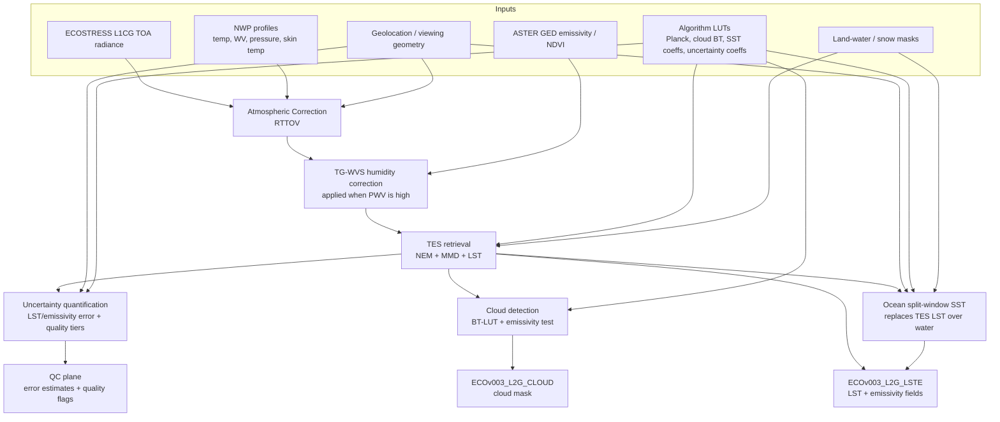

# ECOSTRESS Level 2 Surface Temperature

[](https://github.com/ECOSTRESS-Collection-3/ECOv003-L2-LSTE/actions/workflows/ci-ubuntu.yml)
[](https://github.com/ECOSTRESS-Collection-3/ECOv003-L2-LSTE/actions/workflows/ci-macos.yml)
[](https://github.com/ECOSTRESS-Collection-3/ECOv003-L2-LSTE/actions/workflows/ci-windows.yml)

This is the main repository for the ECOsystem Spaceborne Thermal Radiometer Experiment on Space Station (ECOSTRESS) collection 3 level 2 surface temperature data product algorithm.

Glynn C. Hulley (he/him)<br>
[glynn.hulley@jpl.nasa.gov](mailto:glynn.hulley@jpl.nasa.gov)<br>
NASA Jet Propulsion Laboratory 321H

Robert Freepartner (he/him)<br>
Raytheon

Tinh La (he/him)<br>
[tinh.t.la@jpl.nasa.gov](mailto:tinh.t.la@jpl.nasa.gov)<br>
NASA Jet Propulsion Laboratory 321H

Dr. Tanvir Islam<br>
NASA Jet Propulsion Laboratory

Dr. Nabin Malakar<br>
NASA Jet Propulsion Laboratory

Simon Latyshev<br>
Raytheon

[Gregory H. Halverson](https://github.com/gregory-halverson-jpl) (they/them)<br>
[gregory.h.halverson@jpl.nasa.gov](mailto:gregory.h.halverson@jpl.nasa.gov)<br>
NASA Jet Propulsion Laboratory 321H

## Prerequisites

### mamba

This C package was designed to be deployed on Linux, but has been retrofitted to compile on macOS and Windows as well, using mamba to consistently install cross-platform dependencies. Continuous integration checks for all three platforms have been included with status badges at the top of the README.

Install [miniforge](https://github.com/conda-forge/miniforge) to obtain `mamba` or `micromamba`. Either is supported — the `MAMBA` variable in the root `Makefile` defaults to `mamba` but can be overridden:

```bash
make environment
```

Running `make environment` creates a conda environment named `ECOv003-L2-LSTE` and installs the following packages from `conda-forge`:

- `hdf4`, `hdf5` — HDF I/O libraries
- `libxml2` — XML configuration parsing
- `eccodes` — GRIB/BUFR meteorological data
- `pkg-config` — build-time dependency resolution

> **Note:** There is no `environment.yml` — packages are installed directly by the `Makefile`. `make install` calls `make environment` automatically, so running them separately is optional.

### RTTOV

This software requires the Radiative Transfer for TOVS (RTTOV) radiative transfer model for atmospheric correction. 

> **Caveat:** RTTOV is not open-source, but is free for registered users.

To obtain it:

1. [Register with the NWP SAF](https://nwp-saf.eumetsat.int/site/register/) (or [log in](https://nwp-saf.eumetsat.int/site/login/) if already registered).
2. Add RTTOV to your software preferences, then download **RTTOV v12** from the [RTTOV v12 page](https://nwp-saf.eumetsat.int/site/software/rttov/rttov-v12/). This package uses **RTTOV 12.2.0**, which is no longer supported by the NWP SAF but remains available for download.

#### Compiling the RTTOV forward model

This repository includes a Fortran 90 forward model driver (`src/rttov_ECOSTRESS_fwd.F90`) that must be compiled against the RTTOV v12 Fortran libraries. Compile it according to the RTTOV v12 build instructions to produce the executable `rttov_ECOSTRESS_fwd.exe`.

#### Coefficient file

The ECOSTRESS instrument coefficient file (`OSP/rtcoef_iss_1_ecostres_v7pred.dat`) is already included in this repository. You do not need to download it separately.

#### Configuring runtime paths

RTTOV is invoked as a subprocess at runtime — it is not linked into the `L2_PGE` binary. Before running the PGE, edit `OSP/PgeRunParameters.xml` to set the correct paths for your installation:

```xml
<scalar name="RttovExe">/path/to/rttov_ECOSTRESS_fwd.exe</scalar>
<scalar name="RttovCoef">/path/to/OSP/rtcoef_iss_1_ecostres_v7pred.dat</scalar>
```

`make install` will succeed without RTTOV present, but the PGE will exit with an error at runtime if `RttovExe` is not a valid path.

#### Licensing

`src/rttov_ECOSTRESS_fwd.F90` carries a EUMETSAT/Met Office copyright. Use of this file is subject to the [RTTOV license agreement](https://nwp-saf.eumetsat.int/site/software/rttov/) accepted upon NWP SAF registration.

## Cross-Platform Installation

A make target for generating a mamba environment has been supplied that will install HDF all other dependencies:

```bash
make environment
```

Activate the `ECOv003-L2-LSTE` mamba environment before compiling:

```bash
mamba activate ECOv003-L2-LSTE
```

Once the mamba environment has been activated on Linux, macOS, or Windows, you should be able to install:

```bash
make install
```

## Algorithm



### End-to-End Processing Stages

The Collection 3 `tes_main.c` workflow can be summarized as the following sequence:

1. Parse run configuration and runtime parameters (`PgeRunParameters.xml`).
2. Read L1 thermal radiance and geolocation.
3. Select 3-band or 5-band thermal processing mode.
4. Optionally load ASTER GED emissivity (for TG/WVS branch).
5. Read and normalize NWP atmosphere (MERRA/GEOS/NCEP paths).
6. Crop and map NWP fields onto RTTOV execution grid.
7. Run RTTOV once (nominal humidity profile).
8. Optionally run RTTOV a second time (humidity scaled by 0.7).
9. Interpolate RTTOV outputs back to granule geometry.
10. Compute corrected surface-leaving radiance.
11. Run TES (NEM + MMD + LST retrieval).
12. Generate cloud product and ingest final cloud mask.
13. Compute SST, uncertainty, and QC refinements.
14. Scale/pack outputs and write LSTE/CLOUD products plus metadata sidecars.

### Band Modes

The code supports two thermal-channel modes:

- 5-band mode: process thermal bands 1, 2, 3, 4, 5
- 3-band mode: process thermal bands 2, 4, 5

Internally, arrays use compact band indices (`b = 0..n_channels-1`), with mapping arrays that translate between compact indices and physical ECOSTRESS thermal band IDs. The LST-driving channel remains band 4 in both modes.

### Atmospheric Correction (RTTOV)

Top-of-atmosphere radiances from the ECOSTRESS L1CG product are atmospherically corrected using RTTOV. NWP atmospheric profiles (temperature, water vapor mixing ratio, pressure, and skin state) are transformed to RTTOV profile format, then passed to an external RTTOV executable. For each band, RTTOV returns:

- atmospheric transmittance (`t`)
- upwelling path radiance (`pathr`)
- downwelling reflected sky radiance (`skyr`)

Standard correction is:

$$L_{surf} = \frac{L_{TOA} - L_{path}}{\tau}$$

where $L_{surf}$ is bottom-of-atmosphere surface-leaving radiance (W/m$^2$/sr/$\mu$m).

#### NWP handling details

- MERRA and GEOS paths read interpolated/cropped atmosphere directly.
- NCEP path reads native fields then upsamples/interpolates prior to RTTOV staging.
- If total column water (`TCW`) is unavailable, it is reconstructed by vertical integration of humidity over pressure.

### Water Vapor Scaling (TG-WVS)

When `RunTgWvs` is enabled, RTTOV is executed twice:

1. Nominal atmosphere (`t1r`, `pathr`, `skyr`).
2. Water-vapor-scaled atmosphere (`t2r`) with humidity profiles and surface humidity multiplied by 0.7.

ASTER GED emissivity and observed radiance are used to estimate `Tg`, then derive per-band gamma terms used to blend the two RTTOV solutions. For each band:

$$t_i = t1r^{\frac{g_i - g_f}{1 - g_f}} \cdot t2r^{\frac{1 - g_i}{1 - g_f}}$$

$$path_i = pathr \cdot \frac{1 - t_i}{1 - t1r}$$

$$L_{surf} = \frac{L_{TOA} - path_i}{t_i}$$

Gamma is clamped/smoothed spatially, low-PWV pixels can be forced to $g_i = 1$, and cloudy pixels are reset to the no-adjustment solution after smoothing.

### Temperature And Emissivity Separation (TES)

TES retrieves LST and emissivity from corrected radiance in radiance space using a LUT-based Planck inversion.

#### NEM step

Starting from assumed maximum emissivity (`emax`):

$$R_i = L_{surf,i} - (1 - \epsilon_{max}) \cdot L_{sky,i}$$

Brightness temperatures are retrieved from the radiance LUT; `Tnem` is the warmest band temperature. The `NEM_planck` loop updates corrected radiance and emissivity until convergence/divergence criteria are met.

Convergence behavior in code:

- success: all band radiance updates are within 0.05 after at least 3 iterations
- failure (divergence): all updates exceed 0.05 after at least 3 iterations
- failure: max iterations reached without convergence

#### MMD and final emissivity

From the NEM emissivity vector `ef`, TES computes normalized contrast (`beta_2`), then maximum-minus-minimum difference (`MMD2`) to estimate minimum emissivity:

$$\epsilon_{min} = co[0] - co[1] \cdot MMD2^{co[2]}$$

Final emissivity spectrum is reconstructed from `beta_2` and $\epsilon_{min}$.

#### LST channel

Final LST is derived from corrected radiance in band 4 (the fixed LST reference channel).

### Cloud Detection

Cloud processing (`process_cloud`) runs after TES and combines:

1. Band-4 BT against time-of-day climatological clear-sky thresholds (00/06/12/18 UTC LUTs).
2. Collection 3 emissivity discriminator using smoothed mean emissivity from bands 4 and 5.

Cloud masks are spatially extended by `cloud_extend`, written to `ECOv003_L2G_CLOUD`, then re-read by the LSTE path for QC and summary metadata.

### Sea Surface Temperature

SST uses a split-window regression with band 4 and 5 brightness temperatures and satellite zenith angle:

$$SST = xeco1 + xeco2 \cdot TB4 + xeco3 \cdot (TB4 - TB5) + xeco4 \cdot (1 - \sec(\theta)) \cdot (TB4 - TB5)$$

Coefficients are loaded from monthly and 6-hourly LUTs (`ECOSTRESS_SSTv3_Coeffs_MM_HH.nc`), cropped around the granule, and bilinearly interpolated to the ECOSTRESS grid.

### Uncertainty And Quality Control

Per-pixel emissivity and LST errors are modeled from precipitable water and view angle:

$$d\epsilon_b = xe[b][0] + xe[b][1] \cdot TCW + xe[b][2] \cdot TCW^2$$

$$dT = xt[0] + xt[1] \cdot TCW + xt[2] \cdot SVA$$

QC is encoded in a 16-bit field updated across the pipeline, including:

- mandatory production state
- missing scan/bad input state
- NEM convergence quality
- sky-radiance contamination quality
- MMD spectral-contrast quality
- emissivity uncertainty tier
- LST uncertainty tier

Additional handling includes missing-scan inflation terms, invalid low/high temperature checks, and forced NaN outputs for not-produced pixels.

### Product Packing And Outputs

Internal floating-point retrievals are packed to product datatypes using fixed scales/offsets prior to writing HDF-EOS outputs. Key fields include:

- `LST`, `SST`
- per-band emissivity and emissivity error
- wideband emissivity (`EmisWB`)
- `LST_err`, `PWV`, `QC`
- `cloud_mask`, geometry support fields

In 3-band mode, placeholder emissivity layers are inserted for schema compatibility with the 5-band product layout.

## References

### Core algorithm and product references

- Hulley, G. C., Göttsche, F. M., Rivera, G., Hook, S. J., Freepartner, R. J., Martin, M. A., Cawse-Nicholson, K., & Johnson, W. R. (2022). Validation and quality assessment of the ECOSTRESS Level-2 land surface temperature and emissivity product. *IEEE Transactions on Geoscience and Remote Sensing, 60*, 1–23. https://doi.org/10.1109/TGRS.2021.3079879

- Gillespie, A., Rokugawa, S., Matsunaga, T., Cothern, J. S., Hook, S., & Kahle, A. B. (1998). A temperature and emissivity separation algorithm for Advanced Spaceborne Thermal Emission and Reflection Radiometer (ASTER) images. *IEEE Transactions on Geoscience and Remote Sensing, 36*(4), 1113–1126. https://doi.org/10.1109/36.700995

- Sabol, D. E., Jr., Gillespie, A. R., Abbott, E., & Yamada, G. (2009). Field validation of the ASTER Temperature–Emissivity Separation algorithm. *Remote Sensing of Environment, 113*(11), 2328–2344. https://doi.org/10.1016/j.rse.2009.06.008

- Hulley, G. C., Hook, S. J., Abbott, E., Malakar, N., Islam, T., & Abrams, M. (2015). The ASTER Global Emissivity Dataset (ASTER GED): Mapping Earth's emissivity at 100 meter spatial scale. *Geophysical Research Letters, 42*(19), 7966–7976. https://doi.org/10.1002/2015GL065564

- Saunders, R., Matricardi, M., & Brunel, P. (1999). An improved fast radiative transfer model for assimilation of satellite radiance observations. *Quarterly Journal of the Royal Meteorological Society, 125*(556), 1407–1425. https://doi.org/10.1002/qj.1999.49712555615

- Saunders, R., Hocking, J., Turner, E., Rayer, P., Rundle, D., Brunel, P., Vidot, J., Roquet, P., Matricardi, M., Geer, A., Bormann, N., & Lupu, C. (2018). An update on the RTTOV fast radiative transfer model (currently at version 12). *Geoscientific Model Development, 11*(7), 2717–2737. https://doi.org/10.5194/gmd-11-2717-2018

- Meng, X., Cheng, J., Yao, B., & Guo, Y. (2022). Validation of the ECOSTRESS land surface temperature product using ground measurements. *IEEE Geoscience and Remote Sensing Letters, 19*, 1–5. https://doi.org/10.1109/LGRS.2021.3123816

