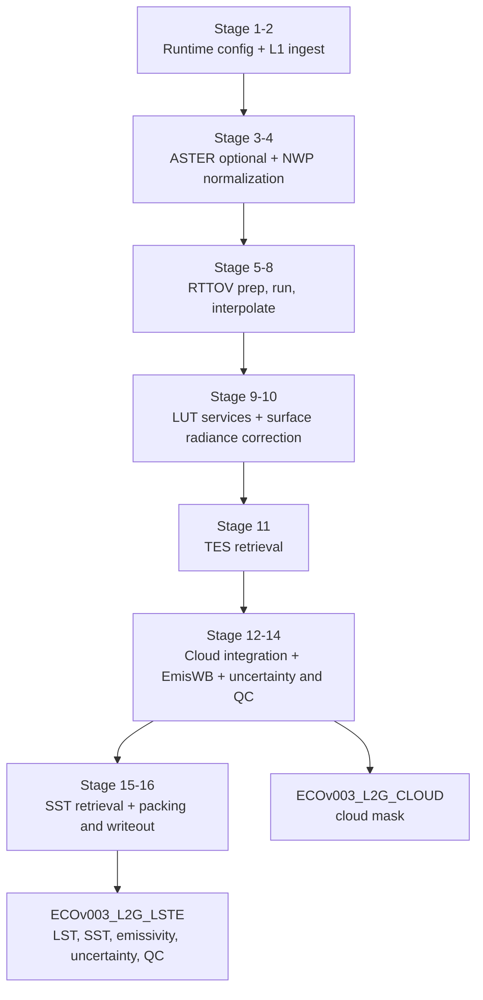
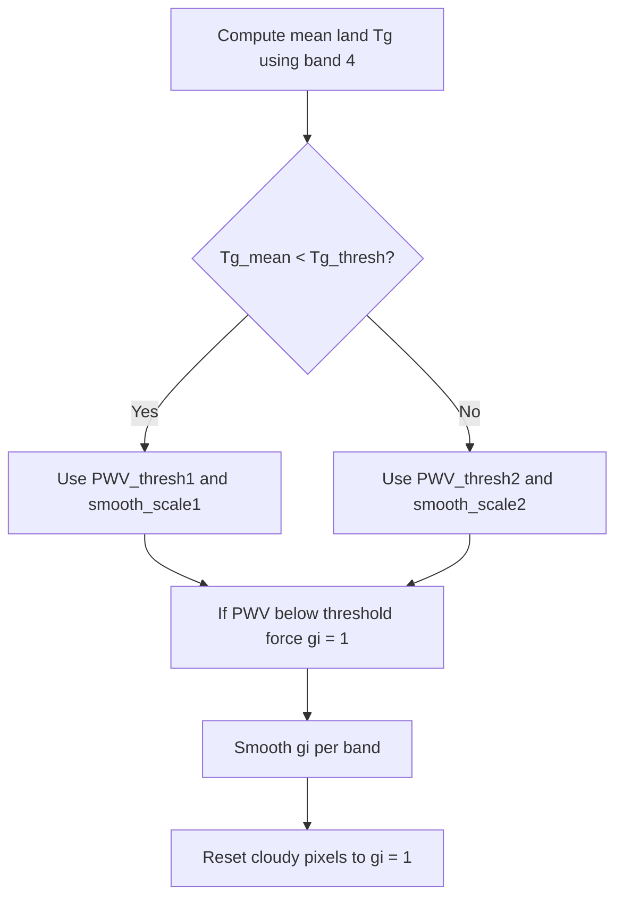

# ECOSTRESS Level 2 Surface Temperature

[](https://github.com/ECOSTRESS-Collection-3/ECOv003-L2-LSTE/actions/workflows/ci-ubuntu.yml)
[](https://github.com/ECOSTRESS-Collection-3/ECOv003-L2-LSTE/actions/workflows/ci-macos.yml)
[](https://github.com/ECOSTRESS-Collection-3/ECOv003-L2-LSTE/actions/workflows/ci-windows.yml)

This is the main repository for the ECOsystem Spaceborne Thermal Radiometer Experiment on Space Station (ECOSTRESS) collection 3 level 2 surface temperature data product algorithm.

Glynn C. Hulley (he/him)<br>
[glynn.hulley@jpl.nasa.gov](mailto:glynn.hulley@jpl.nasa.gov)<br>
NASA Jet Propulsion Laboratory 321H

Robert Freepartner (he/him)<br>
Raytheon

Tinh La (he/him)<br>
[tinh.t.la@jpl.nasa.gov](mailto:tinh.t.la@jpl.nasa.gov)<br>
NASA Jet Propulsion Laboratory 321H

Dr. Tanvir Islam<br>
NASA Jet Propulsion Laboratory

Dr. Nabin Malakar<br>
NASA Jet Propulsion Laboratory

Simon Latyshev<br>
Raytheon

[Gregory H. Halverson](https://github.com/gregory-halverson-jpl) (they/them)<br>
[gregory.h.halverson@jpl.nasa.gov](mailto:gregory.h.halverson@jpl.nasa.gov)<br>
NASA Jet Propulsion Laboratory 321H

## Prerequisites

### mamba

This C package was designed to be deployed on Linux, but has been retrofitted to compile on macOS and Windows as well, using mamba to consistently install cross-platform dependencies. Continuous integration checks for all three platforms have been included with status badges at the top of the README.

Install [miniforge](https://github.com/conda-forge/miniforge) to obtain `mamba` or `micromamba`. Either is supported — the `MAMBA` variable in the root `Makefile` defaults to `mamba` but can be overridden:

```bash
make environment
```

Running `make environment` creates a conda environment named `ECOv003-L2-LSTE` and installs the following packages from `conda-forge`:

- `hdf4`, `hdf5` — HDF I/O libraries
- `libxml2` — XML configuration parsing
- `eccodes` — GRIB/BUFR meteorological data
- `pkg-config` — build-time dependency resolution

> **Note:** There is no `environment.yml` — packages are installed directly by the `Makefile`. `make install` calls `make environment` automatically, so running them separately is optional.

### RTTOV 

This software requires the Radiative Transfer for TOVS (RTTOV) radiative transfer model for atmospheric correction. 

> **Caveat:** RTTOV is not open-source, but is free for registered users.

To obtain it:

1. [Register with the NWP SAF](https://nwp-saf.eumetsat.int/site/register/) (or [log in](https://nwp-saf.eumetsat.int/site/login/) if already registered).
2. Add RTTOV to your software preferences, then download **RTTOV v12** from the [RTTOV v12 page](https://nwp-saf.eumetsat.int/site/software/rttov/rttov-v12/). This package uses **RTTOV 12.2.0**, which is no longer supported by the NWP SAF but remains available for download.

#### Compiling the RTTOV forward model

This repository includes a Fortran 90 forward model driver (`src/rttov_ECOSTRESS_fwd.F90`) that must be compiled against the RTTOV v12 Fortran libraries. Compile it according to the RTTOV v12 build instructions to produce the executable `rttov_ECOSTRESS_fwd.exe`.

#### Coefficient file

The ECOSTRESS instrument coefficient file (`OSP/rtcoef_iss_1_ecostres_v7pred.dat`) is already included in this repository. You do not need to download it separately.

#### Configuring runtime paths

RTTOV is invoked as a subprocess at runtime — it is not linked into the `L2_PGE` binary. Before running the PGE, edit `OSP/PgeRunParameters.xml` to set the correct paths for your installation:

```xml
<scalar name="RttovExe">/path/to/rttov_ECOSTRESS_fwd.exe</scalar>
<scalar name="RttovCoef">/path/to/OSP/rtcoef_iss_1_ecostres_v7pred.dat</scalar>
```

`make install` will succeed without RTTOV present, but the PGE will exit with an error at runtime if `RttovExe` is not a valid path.

#### Licensing

`src/rttov_ECOSTRESS_fwd.F90` carries a EUMETSAT/Met Office copyright. Use of this file is subject to the [RTTOV license agreement](https://nwp-saf.eumetsat.int/site/software/rttov/) accepted upon NWP SAF registration.

## Cross-Platform Installation

A make target for generating a mamba environment has been supplied that will install HDF all other dependencies:

```bash
make environment
```

Activate the `ECOv003-L2-LSTE` mamba environment before compiling:

```bash
mamba activate ECOv003-L2-LSTE
```

Once the mamba environment has been activated on Linux, macOS, or Windows, you should be able to install:

```bash
make install
```

## Algorithm



This section is an implementation-level specification of the Collection 3 processing flow centered on `src/tes_main.c`, including branching logic, variable semantics, formulas, and output conventions.

### Scope

The algorithm section covers:

1. Product orchestration: runtime configuration, input/output naming, metadata updates.
2. Physics retrieval: NWP ingest, RTTOV execution, TG/WVS, TES retrieval.
3. Product augmentation: cloud integration, SST retrieval path, uncertainty model, QC flags.

The section assumes helper functions are available for ASTER GED ingestion, NWP readers, interpolation, smoothing, and cloud generation.

### Key Inputs And Outputs

| Item | Role |
| --- | --- |
| L1CG_RAD / L1B_RAD | Per-band top-of-atmosphere thermal radiance input |
| L1B_GEO (Collection 2 path) | Geolocation source for legacy path |
| ASTER GED | Auxiliary emissivity for TG/WVS branch |
| NWP source | Temperature, humidity, pressure, surface state, TCW |
| RTTOV executable + coefficient file | Atmospheric forward model |
| Radiance/temperature LUT | Radiance-to-BT and BT-to-radiance conversions |
| SST coefficient LUTs | Split-window regression coefficients |
| LSTE output | LST, SST, emissivity, uncertainty, QC, support fields |
| CLOUD output | Final cloud mask used by LSTE QC refinements |

### Band Conventions

| Mode | Loaded thermal bands | Internal mapping (`band[]`) | LST reference band |
| --- | --- | --- | --- |
| 5-band | 1, 2, 3, 4, 5 | `[0, 1, 2, 3, 4]` | Band 4 |
| 3-band | 2, 4, 5 | `[1, 3, 4]` | Band 4 |

Internal arrays are indexed by compact band index `b = 0..n_channels-1`. Mapping arrays convert between compact index and physical ECOSTRESS band IDs.

### Core State Variables

| Variable | Meaning |
| --- | --- |
| `Y[b,line,pixel]` | Observed TOA radiance |
| `t1r[b,line,pixel]` | RTTOV pass-1 transmittance |
| `t2r[b,line,pixel]` | RTTOV pass-2 transmittance (WVS branch) |
| `pathr[b,line,pixel]` | Upwelling path radiance |
| `skyr[b,line,pixel]` | Downwelling sky radiance |
| `pwv[line,pixel]` | Interpolated total column water vapor |
| `surfradi[b,line,pixel]` | Atmospherically corrected surface-leaving radiance |
| `Tg[b,line,pixel]` | TG/WVS brightness-temperature surrogate |
| `g[b,line,pixel]` | Raw gamma factor |
| `gi[b,line,pixel]` | Smoothed/modified gamma used in blending |
| `Ts[line,pixel]` | Retrieved land surface temperature |
| `emisf[b,line,pixel]` | Retrieved emissivity per thermal band |
| `QC[line,pixel]` | 16-bit quality-control field |

### Stage 1: Runtime Configuration

Startup sequence:

1. Parse run configuration XML provided on the command line.
2. Parse `OSP/PgeRunParameters.xml`.
3. Verify runtime `PGEVersion` matches compiled version.
4. Load key directories, orbit/scene identifiers, product counter, and runtime tunables.
5. Build output filenames and metadata scaffolding.

### Stage 2: L1 Radiance and Geometry Ingest

1. Read selected thermal radiance bands into `Y`.
2. Read geolocation (and Collection 2 GEO path when applicable).
3. Compute granule lat/lon extrema for NWP crop bounds.

### Stage 3: Optional ASTER GED (Global Emissivity Dataset) Ingest

When TG/WVS is enabled, ASTER GED emissivity is loaded over the granule footprint and used by the `Tg` branch. If disabled, ASTER ingestion is skipped.

### Stage 4: NWP (Numerical Weather Prediction) Normalization

NWP path is selected from configured source key (MERRA/GEOS/NCEP/ECMWF). Operational behavior includes source-dependent interpolation/cropping and field clamping.

If total column water (`tcw`) is missing, it is reconstructed via pressure-layer integration. Conversion constant:

$$k_{\mathrm{ppmv\to g/kg}} = \frac{1}{1000 \cdot (28.966 / 18.015)}$$

Integrated TCW estimate:

$$\mathrm{TCW} = \frac{\sum dq \cdot dp \cdot k_{\mathrm{ppmv\to g/kg}}}{100 \cdot 9.8}$$

### Stage 5: RTTOV  Grid Preparation

1. Build 2-D NWP lat/lon meshes.
2. Crop NWP fields to granule extent with margin (except GEOS pre-cropped path).
3. Slice cropped atmospheric fields (`cropT`, `cropQ`, `cropSP`, `cropTCW`, etc.).
4. Map granule geometry to cropped NWP grid (nearest-neighbor remap).
5. Choose RTTOV skin-temperature input (`skt` if available, else lowest atmospheric level).

### Stage 6: RTTOV  Profile Packing

Atmospheric arrays are reshaped into the binary profile format expected by RTTOV:

- repair invalid vertical temperatures/humidity
- derive near-surface state when missing (`t2`, `q2` fallback)
- enforce positivity where RTTOV requires it
- apply required ordering/transposition for RTTOV interface

### Stage 7: RTTOV  Execution

Pass 1 (always):

1. Write `prof_in.bin` with nominal humidity.
2. Execute RTTOV wrapper (`script exe coef`).
3. Read output radiances/transmittance.

Pass 2 (TG/WVS only):

1. Rewrite profile with humidity multiplied by 0.7 (profile + surface).
2. Re-run RTTOV wrapper.
3. Read second output set.

### Stage 8: Interpolate RTTOV  Outputs To Granule

RTTOV coarse-grid fields are bilinearly interpolated to the granule grid:

- `t1r` from pass 1 transmittance
- `t2r` from pass 2 transmittance (if enabled)
- `pathr` from pass 1 upwelling radiance
- `skyr` from pass 1 downwelling radiance
- `pwv` from interpolated total column water

If first-pass transmittance is non-positive everywhere, processing aborts for the granule.

### Stage 9: LUT (Look-Up Table) Services

A 6-column radiance/temperature LUT is loaded and used for all BT/radiance conversions:

| Column | Meaning |
| --- | --- |
| `lut[0]` | Brightness temperature |
| `lut[1..5]` | Band 1..5 radiance |

No analytic Planck expression is used in final operational retrieval; LUT conversions are authoritative.

### Stage 10: Surface Radiance Correction

#### Standard branch (no TG/WVS — Temperature-Gradient / Water Vapor Scaling)

$$L_{surf} = \frac{Y - pathr}{t1r}$$

#### TG/WVS (Temperature-Gradient / Water Vapor Scaling) branch

TG/WVS computes per-band `Tg`, converts to blackbody-equivalent radiance `B`, then derives gamma factors used to blend pass-1 and pass-2 RTTOV states.

Core terms:

$$g_f = g_2^{bmp[band]}$$

$$\mathrm{term1} = \frac{t2r}{t1r^{g_f}}$$

$$\mathrm{term2t} = \frac{B - \frac{pathr}{1 - t1r}}{Y - \frac{pathr}{1 - t1r}}$$

$$\mathrm{term3} = \frac{t2r}{t1r}$$

$$g = \frac{\log(\mathrm{term1} \cdot \mathrm{term2t}^{g_1 - g_f})}{\log(\mathrm{term3})}$$

After clamping/smoothing and cloud handling, blended atmospheric terms are:

$$t_i = t1r^{\frac{g_i - g_f}{1 - g_f}} \cdot t2r^{\frac{1 - g_i}{1 - g_f}}$$

$$path_i = pathr \cdot \frac{1 - t_i}{1 - t1r}$$

$$L_{surf} = \frac{Y - path_i}{t_i}$$

In the TG/WVS branch, negative corrected radiance is treated as invalid.

TG/WVS control logic:



# Stage 11: Temperature-Emissivity Separation (TES) Retrieval

## 1. Architectural Overview & Context

The Temperature-Emissivity Separation (TES) algorithm is the definitive core retrieval stage of the thermal infrared processing pipeline. Operating independently on a per-pixel basis, this stage consumes surface and sky radiances that have undergone atmospheric attenuation correction. It breaks the mathematical underdetermination inherent in thermal remote sensing—where an $N$-channel sensor observes $N+1$ unknowns ($N$ spectral emissivities plus 1 surface temperature)—by utilizing empirical relationships derived from natural spectral variation.

The algorithm can execute in either a standard direct correction mode or an optimized water vapor scaling (WVS) mode that resolves residual boundary layer mismatches. It dynamically accommodates variations in instrument channel configurations (e.g., 3-band versus 5-band payloads) through virtualized index mapping.

---

## 2. Interface Definitions (Inputs & Outputs)

An implementation must guarantee access to the following uniform grid spaces and configuration fields. Dimensions are structured as $[B \times L \times P]$ where $B$ represents the configured channel count, $L$ represents grid lines, and $P$ represents line pixels.

### Primary Input Datasets

| Identifier | Description | Data Type | Physical Units / Range | Dimension |
| --- | --- | --- | --- | --- |
| `Y` | Observed top-of-atmosphere total radiance spectrum | Float64 | $\mathrm{W \cdot m^{-2} \cdot sr^{-1} \cdot \mu m^{-1}}$ | $[B \times L \times P]$ |
| `L_sky` | Downwelling atmospheric sky radiance spectrum | Float64 | $\mathrm{W \cdot m^{-2} \cdot sr^{-1} \cdot \mu m^{-1}}$ | $[B \times L \times P]$ |
| `t1` | Upwelling atmospheric path transmittance | Float64 | 0.0 to 1.0 | $[B \times L \times P]$ |
| `t2` | Secondary scaled atmospheric transmittance (WVS Mode) | Float64 | 0.0 to 1.0 | $[B \times L \times P]$ |
| `L_path` | Upwelling atmospheric path radiance | Float64 | $\mathrm{W \cdot m^{-2} \cdot sr^{-1} \cdot \mu m^{-1}}$ | $[B \times L \times P]$ |
| `PWV` | Total column precipitable water vapor | Float64 | $\mathrm{g \cdot cm^{-2}}$ or **cm** | $[L \times P]$ |
| `SVA` | Sensor viewing angle | Float64 | 0.0 to 90.0 degrees | $[L \times P]$ |
| `surface_mask` | Surface boundary type indicator (0 = land, 1 = water) | UInt8 | Enumerated Flag | $[L \times P]$ |
| `data_quality` | Input scan line diagnostic array per channel | Int32 | 0 = Nominal, $\ge 1$ = Anomalous/Filled | $[B \times L \times P]$ |

### Primary Output Datasets

| Identifier | Description | Data Type | Physical Units / Scale | Dimension |
| --- | --- | --- | --- | --- |
| `Ts` | Derived Land Surface Temperature (LST) | UInt16 | Scale: 0.02, Offset: 0.0 (**K**) | $[L \times P]$ |
| `emisf` | Solved Surface Emissivity spectrum | UInt8 | Scale: 0.002, Offset: 0.49 | $[B \times L \times P]$ |
| `EmisWB` | Derived wide-band structural emissivity | UInt8 | Scale: 0.002, Offset: 0.49 | $[L \times P]$ |
| `dT` | Propagated temperature uncertainty estimate | UInt8 | Scale: 0.04, Offset: 0.0 (**K**) | $[L \times P]$ |
| `de` | Propagated emissivity uncertainty spectrum | UInt16 | Scale: 1.0e-4, Offset: 0.0 | $[B \times L \times P]$ |
| `QC` | 16-bit packed quality control flag array | UInt16 | Bitwise Bitmask Fields | $[L \times P]$ |

### Global Runtime Configuration Parameters

* `run_tgwvs`: Boolean flag enabling or disabling the multi-pass Water Vapor Scaling extension loop.
* `it`: Integer parameter defining the absolute iteration timeout threshold for the Planck numerical engine (Default: 13).
* `emax_veg` / `emax_bare`: Empirical ceiling limits for maximum emissivity initialization (Defaults: 0.985 / 0.970).
* `co_veg` / `co_bare`: Array coefficients $[c_0, c_1, c_2]$ mapping spectral contrast to empirical minima regression.
* `emis_wb_coeffs`: Channel blending coefficients utilized to compile broadband emissivity.
* `xe`: Sub-matrix array storing channel-specific coefficients for spectral emissivity error estimation.
* `xt`: Array coefficients mapping environmental parameters to temperature retrieval uncertainty.

---

## 3. Preprocessing & Configuration Staging

### Virtualized Channel Mapping

To accommodate multi-instrument cross-compatibility, raw payload bands must map to an abstract zero-indexed compilation layout of length $N$. Reference tracking variables establish structural access:

* **5-Band Mode:** Mapped directly $[B_1 \to 0, B_2 \to 1, B_3 \to 2, B_4 \to 3, B_5 \to 4]$. $N = 5$.
* **3-Band Mode:** Mapped selectively to compact array slots $[B_2 \to 0, B_4 \to 1, B_5 \to 2]$. Channels $B_1$ and $B_3$ are treated as unpopulated dummy spans. $N = 3$.

Regardless of mode complexity, specific physical reference points remain fixed to their relative spectral channels:

* **The Temperature Reference Channel ($b_{LST}$):** Statically tracked to physical band $B_4$ (Internal compact index 3 in 5-band mode, index 1 in 3-band mode).
* **The Normalization Range:** Shape validation and mean spectral calculations default to tracking data slices correlating to physical bands $B_2$ through $B_4$.

### Coefficient Selection

For every grid point, surface classifications drive the selection of standard baseline variables. If the runtime system configuration does not update the `surface_mask` plane, the execution baseline safely falls back to the bare-soil spectrum family across the entire workspace:

$$(co, \epsilon_{max})=
\begin{cases}
(co_{veg}, \epsilon_{max,veg}), & \text{surface\_mask} = 0 \\
(co_{bare}, \epsilon_{max,bare}), & \text{surface\_mask} \neq 0
\end{cases}$$

---

## 4. Atmospheric Refinement & Correction Core

Depending on runtime system controls, inputs route through one of two correction tracks to calculate the adjusted surface radiance grid ($L_{surf}$):

```mermaid
flowchart TD
    Q{Is run_tgwvs enabled?}
    Q -- Yes --> WVS[Water Vapor Scaling Track<br/>Compute Tg via LUT<br/>Compute gamma terms and ratios<br/>Apply 2D spatial smoothing<br/>Derive WVS-scaled ti parameters<br/>Compute L_surf = (Y - L_pathi) / ti]
    Q -- No --> DIR[Direct Correction Track<br/>Compute L_surf = (Y - L_path) / t1]
```

### Track A: Direct Correction Mode (`run_tgwvs = false`)

Surface radiances derive explicitly from a single-pass extraction of upwelling path parameters:

$$L_{surf,i} = \frac{Y_i - L_{path,i}}{t_{1,i}}$$

If $L_{surf,i} < 0.0$, the spectrum at that coordinate is flagged as invalid and assigned NaN.

### Track B: Water Vapor Scaling Mode (`run_tgwvs = true`)

1. **First-Pass Temperature Approximation ($T_g$):** Extracted using empirical coefficient parameters linked to raw channel groupings, tracking diurnal variations against localized day/night flags.
2. **First-Pass Radiance Mapping ($B_i$):** Derived by processing $T_g$ directly into brightness equivalent fields via Look-Up Table (LUT) conversion:
$$B_i = \mathrm{LUT}_{temp \to rad}(T_g, i)$$


3. **Scaling Term Computations ($\gamma_i$):** Calculated for each channel to locate scaling factors:
$$\gamma_i = \frac{\ln\left(\frac{t_{2,i}}{t_{1,i}^{\alpha}}\right)}{\ln(t_{1,i})}, \quad \text{where } \alpha = 0.7^{\beta_i}$$


$$\text{Numerator}_i = B_i - \frac{L_{path,i}}{1.0 - t_{1,i}}, \quad \text{Denominator}_i = Y_i - \frac{L_{path,i}}{1.0 - t_{1,i}}$$


$$g_i = \frac{\ln\left(\frac{t_{2,i}}{t_{1,i}^{\alpha}} \cdot \left[\frac{\text{Numerator}_i}{\text{Denominator}_i}\right]^{1.0 - \alpha}\right)}{\ln(t_{1,i})}$$


If logarithmic structures produce complex results, the corresponding grid point resets to a baseline of $1.0$.
4. **Spatial Boundary Smoothing:** Ground configurations map bare grid spaces directly to the physical reference channel's scale ($g_i = g_{B5}$). The composite arrays scale between boundaries $-2.0$ and $3.0$, and pass through a two-dimensional spatial box-car filter over scale lengths specified by atmospheric moisture levels.
5. **Final Radiance Reconstruction:** Cloud spaces reset scaling multipliers back to unity ($\gamma_i = 1.0$). Refined transmittances ($t_{i}$) and path radiances ($L_{path,i}$) are calculated to output the corrected surface radiance spectrum ($L_{surf}$):
$$t_{i} = t_{1,i}^{\frac{\gamma_i - \alpha}{1.0 - \alpha}} \cdot t_{2,i}^{\frac{1.0 - \gamma_i}{1.0 - \alpha}}$$


$$L_{path,i} = L_{path,i} \cdot \left(\frac{1.0 - t_{i}}{1.0 - t_{1,i}}\right)$$


$$L_{surf,i} = \frac{Y_i - L_{path,i}}{t_{i}}$$


---

## 5. Core Retrieval Solver (NEM-Planck Engine)

The Normalized Emissivity Method (NEM) module executes iteratively for every valid pixel spatial coordinate.

```mermaid
flowchart TD
    Start[Initialize Pixel Retrieval] --> CheckNaN{Is NaN present in\n L_surf or L_sky?}
    CheckNaN -- Yes --> MarkFail[Flag Pixel as\n Not Produced in QC] --> End[Exit Pixel Loop]
    CheckNaN -- No --> InitRad[Compute Initial Corrected Radiance\n R_i^(0) via emax Ceilings]
    InitRad --> InitTemp[Derive Channel Temperatures T_i^(0)\n Seek Max T_nem^(0)]
    InitTemp --> Loop[Enter Iteration Loop: k = 1 to it]
    Loop --> LoopCeil{Is k == it?\n Timeout Ceil}
    LoopCeil -- Yes --> MarkFail
    LoopCeil -- No --> IterRad[Compute Iterative Radiance Spectrum\n Re_i^(k) using current e_i]
    IterRad --> IterTemp[Invert Radiance via LUT\n Seek Max T_nem^(k)]
    IterTemp --> CalcDelta[Compute Channel Residuals\n Delta_i = Re_i - R_old]
    CalcDelta --> CheckConverge{Are ALL Channel Residuals\n |Delta_i| < 0.05 AND k > 2?}
    CheckConverge -- Yes --> OutSuccess[Output Solved Matrix State] --> End
    CheckConverge -- No --> CheckDiverge{Are ALL Channel Residuals\n Delta_i > 0.05 AND k > 2?}
    CheckDiverge -- Yes --> MarkFail
    CheckDiverge -- No --> UpdateEmis[Update Emissivity Track\n e_i = Re_i / B_i] --> LoopNext[Advance: k = k + 1] --> Loop

```

### Numerical Mathematical Sequence

1. **Environmental Data Validation:**
If any channel structural slice contains a NaN parameter, the solver exits immediately, flagging the pixel within the quality array mask:
$$\exists i \in \{1, \dots, N\} : \mathrm{isnan}(L_{surf,i}) \lor \mathrm{isnan}(L_{sky,i}) \Rightarrow \text{Abort Initialization}$$


2. **Radiances Initialization:**
Corrected radiances are initialized by applying the chosen maximum emissivity ceiling across all channels:
$$R_i^{(0)} = L_{surf,i} - (1.0 - \epsilon_{max}) L_{sky,i}$$


3. **Temperature Bounds Extraction:**
Each calculated initialization radiance transforms into localized temperature spaces using the lookup structure:
$$T_i^{(0)} = \mathrm{LUT}_{rad \to temp}\left(\frac{R_i^{(0)}}{\epsilon_{max}}, \; i\right)$$


The localized baseline temperature maximum targets the warmest available path channel:
$$T_{nem}^{(0)} = \max_i \; T_i^{(0)}$$


4. **Iterative Loops Track Calculation ($k = 1, 2, \dots, it$):**
* **Blackbody Equivalence Transformation:**
$$B_i = \mathrm{LUT}_{temp \to rad}\left(T_{nem}^{(k-1)}, \; i\right)$$


* **Emissivity Matrix Estimation:**
$$e_i^{(k)} = \frac{R_i^{(k-1)}}{B_i}$$


* **Radiance Recalculation:**
$$Re_i^{(k)} = L_{surf,i} - \left(1.0 - e_i^{(k)}\right) L_{sky,i}$$


* **Residual Delta Evaluation:**
The numerical convergence distance tracks changes in radiance balances over time:
$$\Delta_i^{(k)} = Re_i^{(k)} - R_{old,i}, \quad \text{where } R_{old,i} = R_i^{(k-1)}$$


* **Termination Control Verification:**
* **Convergence Match (Success):**
$$\left(\forall i : |\Delta_i^{(k)}| < 0.05\right) \land (k > 2) \Rightarrow \text{Halt Engine (Output State Solved)}$$


* **Divergence Escape (Failure Run):**
$$\left(\forall i : \Delta_i^{(k)} > 0.05\right) \land (k > 2) \Rightarrow \text{Halt Engine (Flag Retrieval Fault)}$$


* **Timeout Limit (Failure Timeout):**
$$k = it \Rightarrow \text{Halt Engine (Flag Loop Timeout)}$$


* **State Vector Updates:**
If none of the termination criteria are met, temperatures recalculate across all channels to prepare for the next iteration step:
$$T_{e,i}^{(k)} = \mathrm{LUT}_{rad \to temp}\left(\frac{Re_i^{(k)}}{e_i^{(k)}}, \; i\right), \quad T_{nem}^{(k)} = \max_i \; T_{e,i}^{(k)}$$


---

## 6. Spectral Recovery (MMD Regression)

Following a successful exit from the NEM block, the resolved final iteration emissivity vector ($e_{f}$) updates natural variance records through Maximum-Minimum Difference (MMD) structural matching.

### Channel Averaging Boundaries

The system calculates a mean value over the compact channels mapped to physical bands $B_2$ through $B_4$:

$$bm2 = \frac{1}{M} \sum_{j \in \{B2 \dots B4\}} e_{f,j}$$

Where $M$ represents the count of valid non-NaN channels located inside the targeted extraction window bounds.

### Beta Spectrum Normalization

The baseline emissivity values are normalized to remove temperature scaling variances while preserving the structural spectral shape:

$$\beta_2[i] = \frac{e_{f,i}}{bm2}$$

The spectral contrast metric derives from the scaled spectrum boundaries:

$$MMD2 = \max(\beta_2) - \min(\beta_2)$$

### Minimum Emissivity Calculation & Final Mapping

The structural contrast scales via empirical power regressions to determine the minimum expected emissivity ($\epsilon_{min}$):

$$\epsilon_{min} = co[0] - co[1] \cdot MMD2^{co[2]}$$

The final retrieved emissivity spectrum array (`emisf`) is reconstructed by scaling the normalized beta values relative to this calculated minimum:

$$\mathrm{emisf}[i] = \beta_2[i] \cdot \frac{\epsilon_{min}}{\min(\beta_2)}$$

### Mathematical Validation Guardrails

To prevent empirical calculation errors or arithmetic division faults, explicit array verification guards check the calculated parameters:

$$\mathrm{emisf}[i]=
\begin{cases}
0.0, & (MMD2 < 0.0) \lor (M = 0) \\
\beta_2[i] \cdot \frac{\epsilon_{min}}{\min(\beta_2)}, & \text{otherwise}
\end{cases}$$

---

## 7. Surface Temperature Derivation & Security Guards

The final Land Surface Temperature (LST) calculation relies on values extracted from the reference channel ($B_4$).

### Temperature Transformation Inversion

1. **Effective Radiance Extraction:** The final corrected radiance at the target reference channel index ($b_{B4}$) is derived from the calculated values:
$$R_{eff,c} = \frac{Reff[b_{B4}]}{\mathrm{emisf}[b_{B4}]}$$


2. **LST Resolution Inversion:** The effective radiance is passed through the temperature inversion lookup tables to determine the final land surface temperature value ($T_s$):
$$T_s = \mathrm{LUT}_{rad \to temp}(R_{eff,c}, \; b_{B4})$$


### Output Field Validation Guards

If a pixel produces anomalous calculation states or unphysical negative emissivity balances at the reference channel boundary, the processing core overrides the localized matrix coordinates to zero out the outputs, preventing corrupted values from propagating downstream:

$$\mathrm{emis2}[b_{B4}] < 0.0 \Rightarrow T_s = 0.0 \;\land\; \forall i \in \{1 \dots N\} : \mathrm{emisf}[i] = 0.0$$

---

## 8. Uncertainty Propagation & Quality Control Staging

### Error Estimation Computations

Localized uncertainty arrays for temperature and emissivity propagate errors externally by referencing environmental variables extracted from the precipitable water vapor (`PWV`) and sensor viewing angle (`SVA`) grid metrics:

$$\Delta \epsilon_i = xe[i][0] + xe[i][1] \cdot \mathrm{PWV} + xe[i][2] \cdot \mathrm{PWV}^2$$

$$\Delta T_s = xt[0] + xt[1] \cdot \mathrm{PWV} + xt[2] \cdot \mathrm{SVA}$$

The mean structural error tracks variations across the available spectrum bands:

$$\Delta \epsilon_{mean} = \sqrt{\frac{1}{N} \sum_{i=1}^N (\Delta \epsilon_i)^2}$$

### Bitwise Quality Control Array Mapping

The output variable `QC` maps diagnostic tracking fields into a single packed 16-bit word structural container via bitwise operations:

| Bit Allocation Spans | Diagnostic Meaning / Logic Conditions | Flag States Encoding Definitions |
| --- | --- | --- |
| **Bits 0 – 1**<br>

<br>*(Mandatory QA)* | Core operational summary tracking pixel readiness states. | `00` = High Quality Produced<br>

<br>`01` = Nominal Quality Produced<br>

<br>`10` = Cloud Covered Pixel Track<br>

<br>`11` = Missing Input / Not Produced |
| **Bits 2 – 3**<br>

<br>*(Data Missing)* | Input raw data structural validity tracking fields. | `00` = All bands nominal input baseline<br>

<br>`01` = Missing scans present but reconstructed via models<br>

<br>`10` = Missing scan gaps could not be reconstructed<br>

<br>`11` = Severe calibration failure flag |
| **Bits 6 – 7**<br>

<br>*(Convergence)* | Tracking speed performance inside the core loop solver block. | `00` = Solved efficiently ($kiter < 5$ iterations)<br>

<br>`01` = Normal execution match ($kiter = 5$ iterations)<br>

<br>`10` = Slow resolution track ($kiter = 6$ iterations)<br>

<br>`11` = Boundary reached without matching convergence criteria |
| **Bits 8 – 9**<br>

<br>*(Sky Contam)* | Sky radiance ratio noise validation thresholds: $r_{sky} = \frac{L_{sky, B2}}{Y_{B2}}$. | `00` = High transparency background ($r_{sky} \le 0.1$)<br>

<br>`01` = Moderate sky reflection load ($0.1 < r_{sky} \le 0.2$)<br>

<br>`10` = Heavy background atmospheric contamination ($0.2 < r_{sky} \le 0.3$)<br>

<br>`11` = Critically degraded noise profile ($r_{sky} > 0.3$) |
| **Bits 10 – 11**<br>

<br>*(MMD Bounds)* | Evaluates spectral variance dimensions against baseline limits. | `00` = Highly dynamic terrain match ($MMD2 \le 0.03$)<br>

<br>`01` = Nominal material diversity ($0.03 < MMD2 \le 0.1$)<br>

<br>`10` = Low spectral contrast environment ($0.1 < MMD2 \le 0.15$)<br>

<br>`11` = Flat featureless spectrum layout ($MMD2 > 0.15$) |
| **Bits 12 – 13**<br>

<br>*(Emis Error)* | Evaluates total emissivity error levels ($\Delta \epsilon_{mean}$) against empirical limits. | `00` = Error within optimal scale bounds ($\le 0.013$)<br>

<br>`01` = Normal expected uncertainty scale ($0.013 < \Delta \epsilon_{mean} \le 0.015$)<br>

<br>`10` = Elevated spectral calculation noise ($0.015 < \Delta \epsilon_{mean} \le 0.017$)<br>

<br>`11` = Highly uncertain structural output ($\Delta \epsilon_{mean} > 0.017$) |
| **Bits 14 – 15**<br>

<br>*(Temp Error)* | Evaluates surface temperature error levels ($\Delta T_s$) against structural boundaries. | `00` = Thermal resolution highly reliable ($\le 1.0\text{ K}$)<br>

<br>`01` = Standard expected processing variance ($1.0\text{ K} < \Delta T_s \le 1.5\text{ K}$)<br>

<br>`10` = Elevated localized temperature noise ($1.5\text{ K} < \Delta T_s \le 2.5\text{ K}$)<br>

<br>`11` = Low reliability retrieval calculation ($\Delta T_s > 2.5\text{ K}$) |

### Post-Solver Quality Downgrades

The quality control module performs a final assessment of the solved parameters to update and downgrade pixel quality ratings where necessary:

* **Mandatory State Downgrade:** If the derived emissivity values at channels $B_4$ and $B_5$ both drop below $0.95$, or if the calculated path transmittance $t1$ at channel $B_2$ falls below $0.4$, the low-order quality tracks force an immediate downgrade across bits 0 and 1 to reflect nominal execution restrictions (`01`).
* **Extreme Thermal Cutoffs:** If the final inverted surface temperature value $T_s$ registers above **380 K** or falls below **100 K**, the anomaly is interpreted as a severe calibration or computation fault. The system overrides the associated data arrays, marking the coordinate as unproduced and setting the mandatory quality bits to a failed state (`11`).

### Stage 12: Cloud Product Integration

Cloud logic executes after TES and includes:

1. BT-LUT threshold test on band 4.
2. Collection-3 emissivity discriminator from smoothed mean emissivity of bands 4 and 5 (written as `emis_cloud`).

`Cloud_final` is produced from the BT-LUT cloud test and re-ingested from CLOUD output for LSTE QC refinement and metadata summaries.

### Stage 13: Wideband Emissivity

Wideband emissivity uses a linear combination of narrowband emissivity:

$$EmisWB = c_0 + \sum_b c_b \cdot emisf[b]$$

Coefficient vectors differ for 3-band and 5-band modes.

### Stage 14: Uncertainty And QC (Quality Control) Refinement

This stage applies the same uncertainty model defined in Section 8.

Notation reconciliation used in this repository:

- `PWV` in Section 8 and `TCW` in implementation refer to the same total-column water vapor predictor.
- Output variable names (`dT`, `de`) correspond to the same quantities denoted by $\Delta T_s$ and $\Delta \epsilon_b$ in Section 8.

Per-band emissivity uncertainty:

$$\Delta \epsilon_b = xe[b][0] + xe[b][1] \cdot \mathrm{PWV} + xe[b][2] \cdot \mathrm{PWV}^2$$

Temperature uncertainty:

$$\Delta T_s = xt[0] + xt[1] \cdot \mathrm{PWV} + xt[2] \cdot \mathrm{SVA}$$

Aggregate emissivity RMSE (same as $\Delta \epsilon_{mean}$ in Section 8):

$$RMSE_\epsilon = \sqrt{\frac{1}{n_{channels}}\sum_b (\Delta \epsilon_b)^2}$$

QC bit groups used in this implementation:

| Bits | Meaning |
| --- | --- |
| 0-1 | Mandatory state (good / nominal / cloudy / not produced) |
| 2-3 | Missing scan / bad input state |
| 6-7 | NEM convergence quality |
| 8-9 | Sky-radiance contamination quality |
| 10-11 | MMD spectral-contrast quality |
| 12-13 | Emissivity uncertainty tier |
| 14-15 | LST uncertainty tier |

Missing scan flags from L1 data quality (`DataQ`) affect both QC and uncertainty inflation terms.

### Stage 15: SST (Sea Surface Temperature) Retrieval

SST coefficients are loaded from monthly and 6-hourly LUT files:

`ECOSTRESS_SSTv3_Coeffs_MM_HH.nc`

Coefficient grids are cropped and bilinearly interpolated to the granule (`xeco1..xeco4`). Then SST is evaluated as:

$$sec(\theta) = \frac{1}{\cos(\theta)}$$

$$SST = xeco1 + xeco2 \cdot TB4 + xeco3 \cdot (TB4 - TB5) + xeco4 \cdot (1 - sec(\theta)) \cdot (TB4 - TB5)$$

Band-4 and band-5 BTs are selected using mode-specific mapping in 3-band and 5-band configurations.

SST is output as a separate dataset and does not overwrite the TES-derived LST dataset.

### Stage 16: Packing And Product Writeout

Internal floating-point arrays are packed to output product datatypes with fixed scale/offset conventions:

| Dataset | Internal units | Output type | Scale | Offset |
| --- | --- | --- | --- | --- |
| `LST` | K | `uint16` | 0.02 | 0 |
| `SST` | K | `uint16` | 0.02 | 0 |
| `LST_err` | K | `uint8` | 0.04 | 0 |
| `Emis*` | unitless | `uint8` | 0.002 | 0.49 |
| `Emis*_err` | unitless | `uint16` | 1e-4 | 0 |
| `EmisWB` | unitless | `uint8` | 0.002 | 0.49 |
| `PWV` | cm | `uint16` | 0.001 | 0 |
| `view_zenith` | degree | `float32` | 1 | 0 |
| `height` | m | `float32` | 1 | 0 |

In 3-band mode, placeholder emissivity layers are written for missing thermal bands to preserve output schema compatibility.

## References

- Hulley, G. C., Göttsche, F. M., Rivera, G., Hook, S. J., Freepartner, R. J., Martin, M. A., Cawse-Nicholson, K., & Johnson, W. R. (2022). Validation and quality assessment of the ECOSTRESS Level-2 land surface temperature and emissivity product. *IEEE Transactions on Geoscience and Remote Sensing, 60*, 1–23. https://doi.org/10.1109/TGRS.2021.3079879

- Gillespie, A., Rokugawa, S., Matsunaga, T., Cothern, J. S., Hook, S., & Kahle, A. B. (1998). A temperature and emissivity separation algorithm for Advanced Spaceborne Thermal Emission and Reflection Radiometer (ASTER) images. *IEEE Transactions on Geoscience and Remote Sensing, 36*(4), 1113–1126. https://doi.org/10.1109/36.700995

- Sabol, D. E., Jr., Gillespie, A. R., Abbott, E., & Yamada, G. (2009). Field validation of the ASTER Temperature–Emissivity Separation algorithm. *Remote Sensing of Environment, 113*(11), 2328–2344. https://doi.org/10.1016/j.rse.2009.06.008

- Hulley, G. C., Hook, S. J., Abbott, E., Malakar, N., Islam, T., & Abrams, M. (2015). The ASTER Global Emissivity Dataset (ASTER GED): Mapping Earth's emissivity at 100 meter spatial scale. *Geophysical Research Letters, 42*(19), 7966–7976. https://doi.org/10.1002/2015GL065564

- Saunders, R., Matricardi, M., & Brunel, P. (1999). An improved fast radiative transfer model for assimilation of satellite radiance observations. *Quarterly Journal of the Royal Meteorological Society, 125*(556), 1407–1425. https://doi.org/10.1002/qj.1999.49712555615

- Saunders, R., Hocking, J., Turner, E., Rayer, P., Rundle, D., Brunel, P., Vidot, J., Roquet, P., Matricardi, M., Geer, A., Bormann, N., & Lupu, C. (2018). An update on the RTTOV fast radiative transfer model (currently at version 12). *Geoscientific Model Development, 11*(7), 2717–2737. https://doi.org/10.5194/gmd-11-2717-2018

- Meng, X., Cheng, J., Yao, B., & Guo, Y. (2022). Validation of the ECOSTRESS land surface temperature product using ground measurements. *IEEE Geoscience and Remote Sensing Letters, 19*, 1–5. https://doi.org/10.1109/LGRS.2021.3123816

