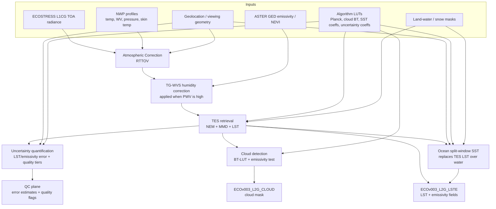
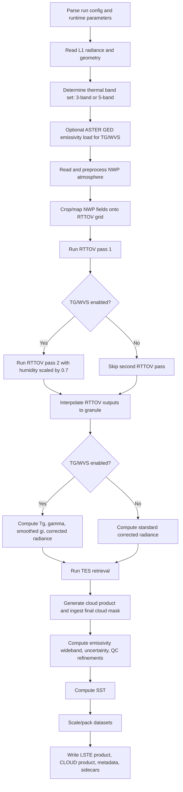
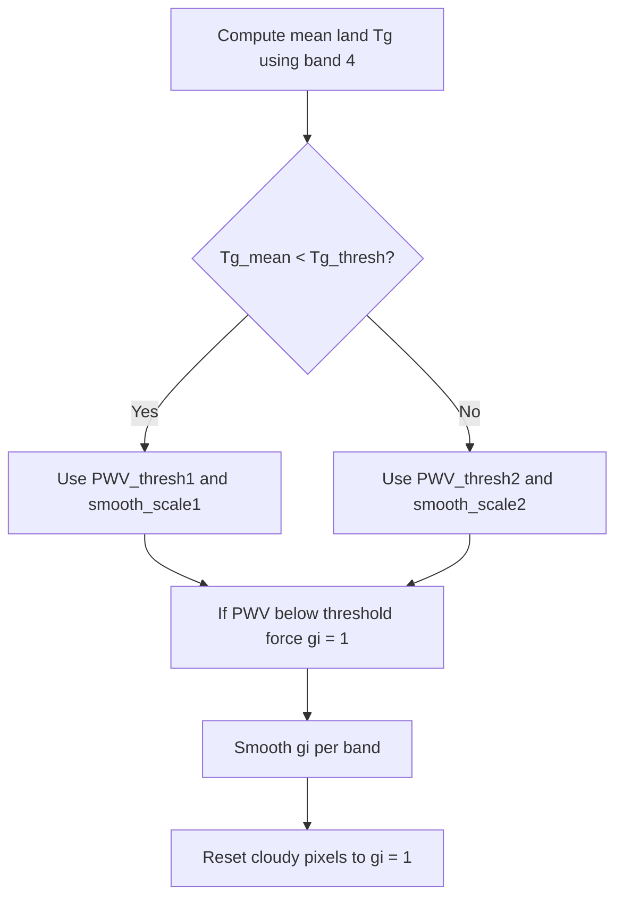
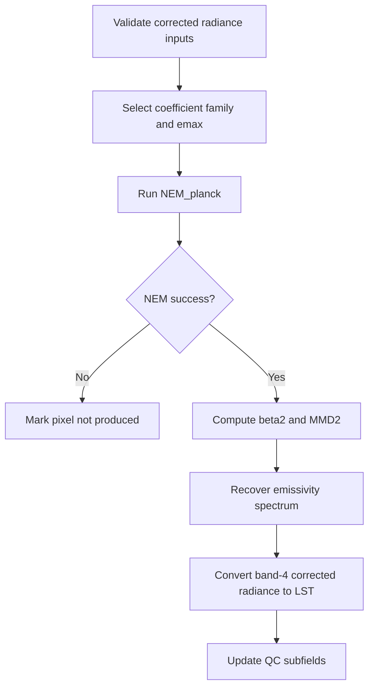

# ECOSTRESS Level 2 Surface Temperature

[](https://github.com/ECOSTRESS-Collection-3/ECOv003-L2-LSTE/actions/workflows/ci-ubuntu.yml)
[](https://github.com/ECOSTRESS-Collection-3/ECOv003-L2-LSTE/actions/workflows/ci-macos.yml)
[](https://github.com/ECOSTRESS-Collection-3/ECOv003-L2-LSTE/actions/workflows/ci-windows.yml)

This is the main repository for the ECOsystem Spaceborne Thermal Radiometer Experiment on Space Station (ECOSTRESS) collection 3 level 2 surface temperature data product algorithm.

Glynn C. Hulley (he/him)<br>
[glynn.hulley@jpl.nasa.gov](mailto:glynn.hulley@jpl.nasa.gov)<br>
NASA Jet Propulsion Laboratory 321H

Robert Freepartner (he/him)<br>
Raytheon

Tinh La (he/him)<br>
[tinh.t.la@jpl.nasa.gov](mailto:tinh.t.la@jpl.nasa.gov)<br>
NASA Jet Propulsion Laboratory 321H

Dr. Tanvir Islam<br>
NASA Jet Propulsion Laboratory

Dr. Nabin Malakar<br>
NASA Jet Propulsion Laboratory

Simon Latyshev<br>
Raytheon

[Gregory H. Halverson](https://github.com/gregory-halverson-jpl) (they/them)<br>
[gregory.h.halverson@jpl.nasa.gov](mailto:gregory.h.halverson@jpl.nasa.gov)<br>
NASA Jet Propulsion Laboratory 321H

## Prerequisites

### mamba

This C package was designed to be deployed on Linux, but has been retrofitted to compile on macOS and Windows as well, using mamba to consistently install cross-platform dependencies. Continuous integration checks for all three platforms have been included with status badges at the top of the README.

Install [miniforge](https://github.com/conda-forge/miniforge) to obtain `mamba` or `micromamba`. Either is supported — the `MAMBA` variable in the root `Makefile` defaults to `mamba` but can be overridden:

```bash
make environment
```

Running `make environment` creates a conda environment named `ECOv003-L2-LSTE` and installs the following packages from `conda-forge`:

- `hdf4`, `hdf5` — HDF I/O libraries
- `libxml2` — XML configuration parsing
- `eccodes` — GRIB/BUFR meteorological data
- `pkg-config` — build-time dependency resolution

> **Note:** There is no `environment.yml` — packages are installed directly by the `Makefile`. `make install` calls `make environment` automatically, so running them separately is optional.

### RTTOV

This software requires the Radiative Transfer for TOVS (RTTOV) radiative transfer model for atmospheric correction. 

> **Caveat:** RTTOV is not open-source, but is free for registered users.

To obtain it:

1. [Register with the NWP SAF](https://nwp-saf.eumetsat.int/site/register/) (or [log in](https://nwp-saf.eumetsat.int/site/login/) if already registered).
2. Add RTTOV to your software preferences, then download **RTTOV v12** from the [RTTOV v12 page](https://nwp-saf.eumetsat.int/site/software/rttov/rttov-v12/). This package uses **RTTOV 12.2.0**, which is no longer supported by the NWP SAF but remains available for download.

#### Compiling the RTTOV forward model

This repository includes a Fortran 90 forward model driver (`src/rttov_ECOSTRESS_fwd.F90`) that must be compiled against the RTTOV v12 Fortran libraries. Compile it according to the RTTOV v12 build instructions to produce the executable `rttov_ECOSTRESS_fwd.exe`.

#### Coefficient file

The ECOSTRESS instrument coefficient file (`OSP/rtcoef_iss_1_ecostres_v7pred.dat`) is already included in this repository. You do not need to download it separately.

#### Configuring runtime paths

RTTOV is invoked as a subprocess at runtime — it is not linked into the `L2_PGE` binary. Before running the PGE, edit `OSP/PgeRunParameters.xml` to set the correct paths for your installation:

```xml
<scalar name="RttovExe">/path/to/rttov_ECOSTRESS_fwd.exe</scalar>
<scalar name="RttovCoef">/path/to/OSP/rtcoef_iss_1_ecostres_v7pred.dat</scalar>
```

`make install` will succeed without RTTOV present, but the PGE will exit with an error at runtime if `RttovExe` is not a valid path.

#### Licensing

`src/rttov_ECOSTRESS_fwd.F90` carries a EUMETSAT/Met Office copyright. Use of this file is subject to the [RTTOV license agreement](https://nwp-saf.eumetsat.int/site/software/rttov/) accepted upon NWP SAF registration.

## Cross-Platform Installation

A make target for generating a mamba environment has been supplied that will install HDF all other dependencies:

```bash
make environment
```

Activate the `ECOv003-L2-LSTE` mamba environment before compiling:

```bash
mamba activate ECOv003-L2-LSTE
```

Once the mamba environment has been activated on Linux, macOS, or Windows, you should be able to install:

```bash
make install
```

## Algorithm



This section is an implementation-level specification of the Collection 3 processing flow centered on `src/tes_main.c`, including branching logic, variable semantics, formulas, and output conventions.

### Scope

The algorithm section covers:

1. Product orchestration: runtime configuration, input/output naming, metadata updates.
2. Physics retrieval: NWP ingest, RTTOV execution, TG/WVS, TES retrieval.
3. Product augmentation: cloud integration, SST replacement path, uncertainty model, QC flags.

The section assumes helper functions are available for ASTER GED ingestion, NWP readers, interpolation, smoothing, and cloud generation.

### Processing Pipeline



### Key Inputs And Outputs

| Item | Role |
| --- | --- |
| L1CG_RAD / L1B_RAD | Per-band top-of-atmosphere thermal radiance input |
| L1B_GEO (Collection 2 path) | Geolocation source for legacy path |
| ASTER GED | Auxiliary emissivity for TG/WVS branch |
| NWP source | Temperature, humidity, pressure, surface state, TCW |
| RTTOV executable + coefficient file | Atmospheric forward model |
| Radiance/temperature LUT | Radiance-to-BT and BT-to-radiance conversions |
| SST coefficient LUTs | Split-window regression coefficients |
| LSTE output | LST, SST, emissivity, uncertainty, QC, support fields |
| CLOUD output | Final cloud mask used by LSTE QC refinements |

### Band Conventions

| Mode | Loaded thermal bands | Internal mapping (`band[]`) | LST reference band |
| --- | --- | --- | --- |
| 5-band | 1, 2, 3, 4, 5 | `[0, 1, 2, 3, 4]` | Band 4 |
| 3-band | 2, 4, 5 | `[1, 3, 4]` | Band 4 |

Internal arrays are indexed by compact band index `b = 0..n_channels-1`. Mapping arrays convert between compact index and physical ECOSTRESS band IDs.

### Core State Variables

| Variable | Meaning |
| --- | --- |
| `Y[b,line,pixel]` | Observed TOA radiance |
| `t1r[b,line,pixel]` | RTTOV pass-1 transmittance |
| `t2r[b,line,pixel]` | RTTOV pass-2 transmittance (WVS branch) |
| `pathr[b,line,pixel]` | Upwelling path radiance |
| `skyr[b,line,pixel]` | Downwelling sky radiance |
| `pwv[line,pixel]` | Interpolated total column water vapor |
| `surfradi[b,line,pixel]` | Atmospherically corrected surface-leaving radiance |
| `Tg[b,line,pixel]` | TG/WVS brightness-temperature surrogate |
| `g[b,line,pixel]` | Raw gamma factor |
| `gi[b,line,pixel]` | Smoothed/modified gamma used in blending |
| `Ts[line,pixel]` | Retrieved land surface temperature |
| `emisf[b,line,pixel]` | Retrieved emissivity per thermal band |
| `QC[line,pixel]` | 16-bit quality-control field |

### Stage 1: Runtime Configuration

Startup sequence:

1. Parse run configuration XML provided on the command line.
2. Parse `OSP/PgeRunParameters.xml`.
3. Verify runtime `PGEVersion` matches compiled version.
4. Load key directories, orbit/scene identifiers, product counter, and runtime tunables.
5. Build output filenames and metadata scaffolding.

### Stage 2: L1 Radiance and Geometry Ingest

1. Read selected thermal radiance bands into `Y`.
2. Read geolocation (and Collection 2 GEO path when applicable).
3. Compute granule lat/lon extrema for NWP crop bounds.

### Stage 3: Optional ASTER GED Ingest

When TG/WVS is enabled, ASTER GED emissivity is loaded over the granule footprint and used by the `Tg` branch. If disabled, ASTER ingestion is skipped.

### Stage 4: NWP Normalization

NWP path is selected from configured source key (MERRA/GEOS/NCEP/ECMWF). Operational behavior includes source-dependent interpolation/cropping and field clamping.

If total column water (`tcw`) is missing, it is reconstructed via pressure-layer integration. Conversion constant:

$$k_{\mathrm{ppmv\to g/kg}} = \frac{1}{1000 \cdot (28.966 / 18.015)}$$

Integrated TCW estimate:

$$\mathrm{TCW} = \frac{\sum dq \cdot dp \cdot k_{\mathrm{ppmv\to g/kg}}}{100 \cdot 9.8}$$

### Stage 5: RTTOV Grid Preparation

1. Build 2-D NWP lat/lon meshes.
2. Crop NWP fields to granule extent with margin (except GEOS pre-cropped path).
3. Slice cropped atmospheric fields (`cropT`, `cropQ`, `cropSP`, `cropTCW`, etc.).
4. Map granule geometry to cropped NWP grid (nearest-neighbor remap).
5. Choose RTTOV skin-temperature input (`skt` if available, else lowest atmospheric level).

### Stage 6: RTTOV Profile Packing

Atmospheric arrays are reshaped into the binary profile format expected by RTTOV:

- repair invalid vertical temperatures/humidity
- derive near-surface state when missing (`t2`, `q2` fallback)
- enforce positivity where RTTOV requires it
- apply required ordering/transposition for RTTOV interface

### Stage 7: RTTOV Execution

Pass 1 (always):

1. Write `prof_in.bin` with nominal humidity.
2. Execute RTTOV wrapper (`script exe coef`).
3. Read output radiances/transmittance.

Pass 2 (TG/WVS only):

1. Rewrite profile with humidity multiplied by 0.7 (profile + surface).
2. Re-run RTTOV wrapper.
3. Read second output set.

### Stage 8: Interpolate RTTOV Outputs To Granule

RTTOV coarse-grid fields are bilinearly interpolated to the granule grid:

- `t1r` from pass 1 transmittance
- `t2r` from pass 2 transmittance (if enabled)
- `pathr` from pass 1 upwelling radiance
- `skyr` from pass 1 downwelling radiance
- `pwv` from interpolated total column water

If first-pass transmittance is non-positive everywhere, processing aborts for the granule.

### Stage 9: LUT Services

A 6-column radiance/temperature LUT is loaded and used for all BT/radiance conversions:

| Column | Meaning |
| --- | --- |
| `lut[0]` | Brightness temperature |
| `lut[1..5]` | Band 1..5 radiance |

No analytic Planck expression is used in final operational retrieval; LUT conversions are authoritative.

### Stage 10: Surface Radiance Correction

#### Standard branch (no TG/WVS)

$$L_{surf} = \frac{Y - pathr}{t1r}$$

#### TG/WVS branch

TG/WVS computes per-band `Tg`, converts to blackbody-equivalent radiance `B`, then derives gamma factors used to blend pass-1 and pass-2 RTTOV states.

Core terms:

$$g_f = g_2^{bmp[band]}$$

$$\mathrm{term1} = \frac{t2r}{t1r^{g_f}}$$

$$\mathrm{term2t} = \frac{B - \frac{pathr}{1 - t1r}}{Y - \frac{pathr}{1 - t1r}}$$

$$\mathrm{term3} = \frac{t2r}{t1r}$$

$$g = \frac{\log(\mathrm{term1} \cdot \mathrm{term2t}^{g_1 - g_f})}{\log(\mathrm{term3})}$$

After clamping/smoothing and cloud handling, blended atmospheric terms are:

$$t_i = t1r^{\frac{g_i - g_f}{1 - g_f}} \cdot t2r^{\frac{1 - g_i}{1 - g_f}}$$

$$path_i = pathr \cdot \frac{1 - t_i}{1 - t1r}$$

$$L_{surf} = \frac{Y - path_i}{t_i}$$

Negative corrected radiance is treated as invalid.

TG/WVS control logic:



### Stage 11: TES Retrieval

TES runs per-pixel on corrected radiance.

#### NEM initialization

$$R_i = L_{surf,i} - (1 - \epsilon_{max}) \cdot L_{sky,i}$$

Radiance is converted to BT by LUT; `Tnem` is the warmest channel.

#### NEM iterative behavior

Convergence rule:

- success when all band updates are within 0.05 radiance units after at least 3 iterations

Divergence rule:

- failure when all band updates increase by more than 0.05 after at least 3 iterations

Timeout rule:

- failure when maximum iteration count is reached without convergence

#### MMD emissivity recovery

Using NEM emissivity estimate `ef`:

$$bm2 = \mathrm{mean}(ef_{bands\ 2..4})$$

$$\beta_2[i] = \frac{ef[i]}{bm2}$$

$$MMD2 = \max(\beta_2) - \min(\beta_2)$$

$$\epsilon_{min} = co[0] - co[1] \cdot MMD2^{co[2]}$$

$$emisf[i] = \beta_2[i] \cdot \frac{\epsilon_{min}}{\min(\beta_2)}$$

#### LST retrieval

Band 4 is always the LST reference channel:

$$R_{eff,c} = \frac{Reff[b_{B4}]}{emisf[b_{B4}]}$$

$$Ts = LUT_{rad\to temp}(R_{eff,c}, band\ 4)$$

TES flow:



### Stage 12: Cloud Product Integration

Cloud logic executes after TES and includes:

1. BT-LUT threshold test on band 4.
2. Emissivity discriminator from smoothed mean emissivity of bands 4 and 5.

Final cloud mask is re-ingested from CLOUD output and used for LSTE QC refinement and metadata summaries.

### Stage 13: Wideband Emissivity

Wideband emissivity uses a linear combination of narrowband emissivity:

$$EmisWB = c_0 + \sum_b c_b \cdot emisf[b]$$

Coefficient vectors differ for 3-band and 5-band modes.

### Stage 14: Uncertainty And QC Refinement

Per-band emissivity uncertainty:

$$d\epsilon_b = xe[b][0] + xe[b][1] \cdot TCW + xe[b][2] \cdot TCW^2$$

Temperature uncertainty:

$$dT = xt[0] + xt[1] \cdot TCW + xt[2] \cdot SVA$$

Aggregate emissivity RMSE:

$$RMSE_\epsilon = \sqrt{\frac{1}{n_{channels}}\sum_b d\epsilon_b^2}$$

QC bit groups used in this implementation:

| Bits | Meaning |
| --- | --- |
| 0-1 | Mandatory state (good / nominal / cloudy / not produced) |
| 2-3 | Missing scan / bad input state |
| 6-7 | NEM convergence quality |
| 8-9 | Sky-radiance contamination quality |
| 10-11 | MMD spectral-contrast quality |
| 12-13 | Emissivity uncertainty tier |
| 14-15 | LST uncertainty tier |

Missing scan flags from L1 data quality (`DataQ`) affect both QC and uncertainty inflation terms.

### Stage 15: SST Retrieval

SST coefficients are loaded from monthly and 6-hourly LUT files:

`ECOSTRESS_SSTv3_Coeffs_MM_HH.nc`

Coefficient grids are cropped and bilinearly interpolated to the granule (`xeco1..xeco4`). Then SST is evaluated as:

$$sec(\theta) = \frac{1}{\cos(\theta)}$$

$$SST = xeco1 + xeco2 \cdot TB4 + xeco3 \cdot (TB4 - TB5) + xeco4 \cdot (1 - sec(\theta)) \cdot (TB4 - TB5)$$

Band-4 and band-5 BTs are selected using mode-specific mapping in 3-band and 5-band configurations.

### Stage 16: Packing And Product Writeout

Internal floating-point arrays are packed to output product datatypes with fixed scale/offset conventions:

| Dataset | Internal units | Output type | Scale | Offset |
| --- | --- | --- | --- | --- |
| `LST` | K | `uint16` | 0.02 | 0 |
| `SST` | K | `uint16` | 0.02 | 0 |
| `LST_err` | K | `uint8` | 0.04 | 0 |
| `Emis*` | unitless | `uint8` | 0.002 | 0.49 |
| `Emis*_err` | unitless | `uint16` | 1e-4 | 0 |
| `EmisWB` | unitless | `uint8` | 0.002 | 0.49 |
| `PWV` | cm | `uint16` | 0.001 | 0 |
| `view_zenith` | degree | `float32` | 1 | 0 |
| `height` | m | `float32` | 1 | 0 |

In 3-band mode, placeholder emissivity layers are written for missing thermal bands to preserve output schema compatibility.

### Reimplementation Notes

For faithful porting and cross-language reproduction:

1. Preserve LUT-driven radiance/temperature conversion in all retrieval paths.
2. Preserve 3-band index remapping exactly.
3. Keep two-pass RTTOV humidity-scaled branch when TG/WVS is enabled.
4. Preserve post-TES cloud-mask ingestion and QC refinement ordering.
5. Preserve scale/offset/fill-value packing conventions for product compatibility.

## References

- Hulley, G. C., Göttsche, F. M., Rivera, G., Hook, S. J., Freepartner, R. J., Martin, M. A., Cawse-Nicholson, K., & Johnson, W. R. (2022). Validation and quality assessment of the ECOSTRESS Level-2 land surface temperature and emissivity product. *IEEE Transactions on Geoscience and Remote Sensing, 60*, 1–23. https://doi.org/10.1109/TGRS.2021.3079879

- Gillespie, A., Rokugawa, S., Matsunaga, T., Cothern, J. S., Hook, S., & Kahle, A. B. (1998). A temperature and emissivity separation algorithm for Advanced Spaceborne Thermal Emission and Reflection Radiometer (ASTER) images. *IEEE Transactions on Geoscience and Remote Sensing, 36*(4), 1113–1126. https://doi.org/10.1109/36.700995

- Sabol, D. E., Jr., Gillespie, A. R., Abbott, E., & Yamada, G. (2009). Field validation of the ASTER Temperature–Emissivity Separation algorithm. *Remote Sensing of Environment, 113*(11), 2328–2344. https://doi.org/10.1016/j.rse.2009.06.008

- Hulley, G. C., Hook, S. J., Abbott, E., Malakar, N., Islam, T., & Abrams, M. (2015). The ASTER Global Emissivity Dataset (ASTER GED): Mapping Earth's emissivity at 100 meter spatial scale. *Geophysical Research Letters, 42*(19), 7966–7976. https://doi.org/10.1002/2015GL065564

- Saunders, R., Matricardi, M., & Brunel, P. (1999). An improved fast radiative transfer model for assimilation of satellite radiance observations. *Quarterly Journal of the Royal Meteorological Society, 125*(556), 1407–1425. https://doi.org/10.1002/qj.1999.49712555615

- Saunders, R., Hocking, J., Turner, E., Rayer, P., Rundle, D., Brunel, P., Vidot, J., Roquet, P., Matricardi, M., Geer, A., Bormann, N., & Lupu, C. (2018). An update on the RTTOV fast radiative transfer model (currently at version 12). *Geoscientific Model Development, 11*(7), 2717–2737. https://doi.org/10.5194/gmd-11-2717-2018

- Meng, X., Cheng, J., Yao, B., & Guo, Y. (2022). Validation of the ECOSTRESS land surface temperature product using ground measurements. *IEEE Geoscience and Remote Sensing Letters, 19*, 1–5. https://doi.org/10.1109/LGRS.2021.3123816

