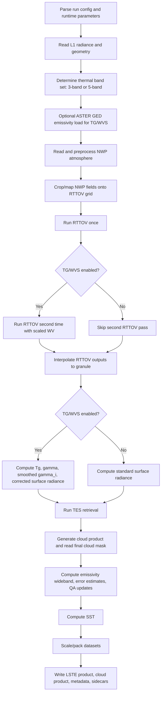
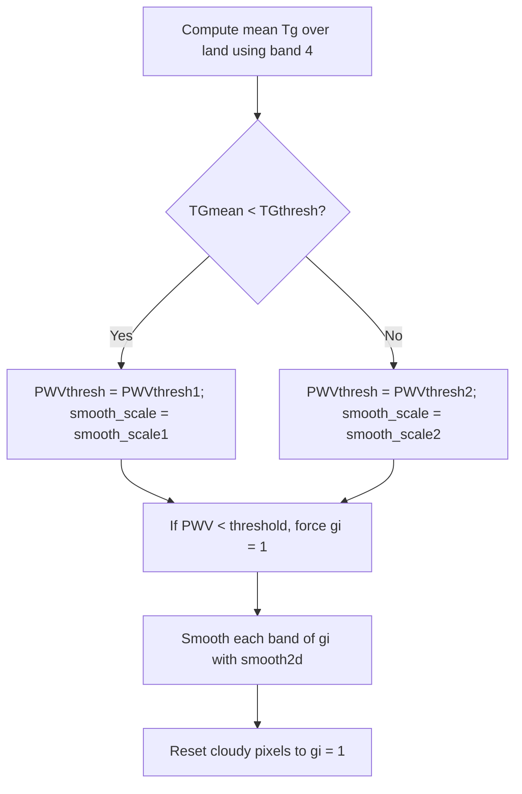
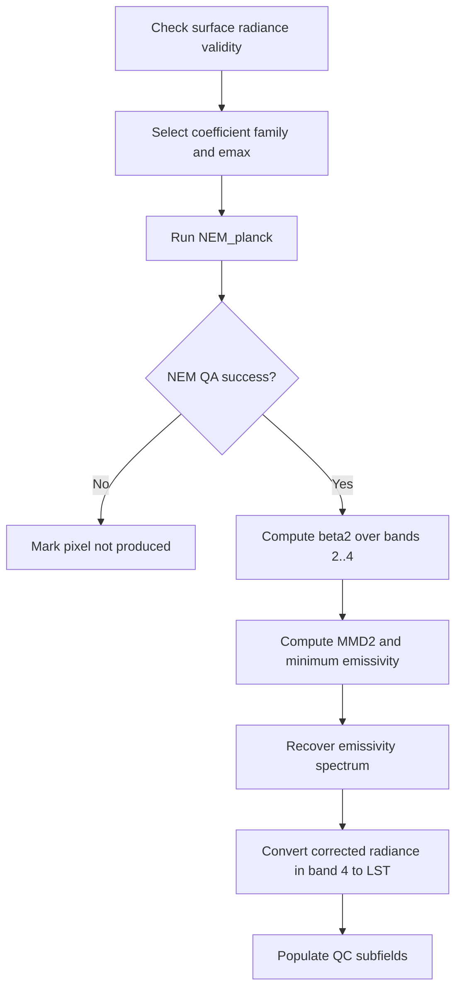

# tes_main.c Algorithm Guide

This document explains the end-to-end workflow implemented in `src/tes_main.c` at pseudocode level. The goal is not to mirror the C syntax line by line, but to describe the processing stages, state transitions, formulas, branching rules, and output semantics well enough to re-implement the pipeline in another language.

The file combines three kinds of logic:

1. Product orchestration: configuration, file naming, metadata, output formatting.
2. Physics workflow: NWP preparation, RTTOV execution, TG/WVS correction, TES retrieval.
3. Product augmentation: cloud product generation, SST, uncertainty estimates, QA flags.

## Scope

This guide covers the behavior that is directly implemented in `tes_main.c`, plus the contracts that the file expects from helper modules such as ASTER GED loading, NWP readers, interpolation, smoothing, cloud generation, and metadata I/O.

It does not re-specify the internal implementation of external helpers such as `read_aster_ged`, `tes_read_interp_atmos_*`, `mapnearest`, `multi_interp2`, `smooth2d`, or `process_cloud`. Instead, it explains how their outputs are consumed here.

## High-Level Pipeline



## Key Inputs And Outputs

| Item | Role in workflow |
| --- | --- |
| L1CG_RAD or L1B_RAD | Source radiance data per thermal band |
| L1B_GEO | Collection 2 geometry source only |
| ASTER GED | Optional auxiliary emissivity input used by TG/WVS |
| NWP source | Atmospheric profiles, pressure, skin temperature, water vapor, total column water |
| RTTOV executable + coefficients | Forward model that produces atmospheric transmission and path radiance |
| Brightness temperature / radiance LUT | Converts between radiance and brightness temperature |
| SST coefficient LUTs | Supplies geographically varying SST regression coefficients |
| Main outputs | LST, SST, emissivity bands, emissivity errors, LST error, PWV, QC, cloud mask, water mask, view angle, height |

## Band Conventions

The code supports either 5 thermal channels or a reduced 3-band mode.

| Mode | Loaded thermal bands | `band[]` values | LST reference band |
| --- | --- | --- | --- |
| 5-band | 1, 2, 3, 4, 5 | `[0,1,2,3,4]` | Band 4 |
| 3-band | 2, 4, 5 | `[1,3,4]` | Band 4 |

Internal arrays are always indexed by the compact processing index `b = 0..n_channels-1`. The `band[]` array maps that compact index back to the physical ECOSTRESS thermal band number minus one. `band_index[]` provides the reverse lookup.

## Core State Variables

| Variable | Meaning |
| --- | --- |
| `Y[b,line,pixel]` | Observed TOA radiance from the L1 radiance product |
| `t1r[b,line,pixel]` | RTTOV atmospheric transmission from the first run |
| `t2r[b,line,pixel]` | RTTOV atmospheric transmission from the second, water-vapor-scaled run |
| `pathr[b,line,pixel]` | Upwelling atmospheric path radiance |
| `skyr[b,line,pixel]` | Downwelling reflected sky radiance |
| `pwv[line,pixel]` | Total column water vapor interpolated back to granule geometry |
| `surfradi[b,line,pixel]` | Surface-leaving radiance after atmospheric correction |
| `Tg[b,line,pixel]` | TG/WVS brightness temperature surrogate |
| `g[b,line,pixel]` | Raw WVS gamma parameter |
| `gi[b,line,pixel]` | Smoothed gamma used to blend two RTTOV runs |
| `Ts[line,pixel]` | Final land surface temperature |
| `emisf[b,line,pixel]` | Final emissivity per thermal band |
| `QC[line,pixel]` | 16-bit quality flag populated incrementally |

## Stage 1: Configuration And Runtime Parameter Loading

The program expects a single command-line argument: the XML run configuration file.

At startup it:

1. Initializes metadata containers.
2. Configures logging.
3. Captures the production timestamp via `date -u`.
4. Captures the processing environment via `uname -a`.
5. Parses the run config XML and extracts:
   - `NWP_DIR`
   - `L2_OSP_DIR`
   - `ProductPath`
   - `ProductCounter`
   - input filenames
   - `OrbitNumber`
   - `SceneID`
6. Parses `PgeRunParameters.xml` from the OSP directory.
7. Verifies that `PGEVersion` in the run parameters matches the compiled constant.
8. Loads a large set of runtime tunables, including:
   - emissivity model coefficients
   - TG/WVS thresholds
   - smoothing scales
   - RTTOV executable/script names
   - LUT filenames
   - ASTER directory override

### Pseudocode

```text
run_config = parse_xml(argv[1])
run_params = parse_xml(OSP_dir + "/PgeRunParameters.xml")
assert run_params.PGEVersion == compiled_PGE_VERSION

NWP_dir = run_config.StaticAncillaryFileGroup.NWP_DIR
OSP_dir = run_config.StaticAncillaryFileGroup.L2_OSP_DIR + "/"
product_path = run_config.ProductPathGroup.ProductPath
product_counter = run_config.ProductPathGroup.ProductCounter

RAD_filename = choose_input_radiance_file(run_config)
GEO_filename = choose_geo_file_if_collection2(run_config)

orbit_number = run_config.Geometry.OrbitNumber
scene_id = run_config.Geometry.SceneID or SceneId

load all runtime parameters with defaults
derive output filenames from orbit, scene, timestamp, version
```

## Stage 2: Band Selection

The program reads the radiance product metadata to determine whether the granule carries 3 or 5 thermal bands.

Behavior:

1. If the radiance file reports anything other than 3 or 5 bands, the code falls back to 3-band mode.
2. In 3-band mode, it processes only thermal bands 2, 4, and 5.
3. It loads different coefficient sets and a different RTTOV wrapper script depending on the band count.

### Important implementation detail

The TES kernel later uses `lst_band_index = band_index[BAND_4]`, so band 4 is always the temperature-driving channel when computing LST from corrected radiance.

## Stage 3: Read L1 Radiance And Geometry

The code initializes a `RAD` structure, reads the thermal radiance bands, and, for Collection 2 only, reads geometry from a separate GEO file.

It then stacks the selected radiance planes into a 3-D array `Y` with shape:

```text
Y[n_channels, n_lines, n_pixels]
```

This is the central radiance tensor used throughout the retrieval.

The code also derives a lat/lon bounding box from the granule geolocation for later NWP cropping.

### Pseudocode

```text
vRAD = read_radiance_and_geometry(RAD_filename, GEO_filename_if_needed, band_selection)

for b in 0 .. n_channels-1:
    Y[b,:,:] = vRAD.Rad[b]

crop.minLat = min(vRAD.Lat)
crop.maxLat = max(vRAD.Lat)
crop.minLon = min(vRAD.Lon)
crop.maxLon = max(vRAD.Lon)
```

## Stage 4: Optional ASTER GED Load

If `RunTgWvs` is enabled, the code loads ASTER GED emissivity over the granule footprint.

Inputs supplied to the ASTER helper:

- granule latitude grid
- granule longitude grid
- water mask
- zero-filled snow/water-index placeholder
- `adjust_aster = false`
- `sensor_type = ECOSTRESS`

Output consumed here:

- `emis_aster[line,pixel]`

If TG/WVS is disabled, ASTER GED is skipped entirely.

## Stage 5: Read And Normalize NWP Atmosphere

The code chooses the NWP reader by inspecting whether `NWP_DIR` contains a configured key such as `MERRA`, `GEOS`, `NCEP`, or `ECMWF`.

### Source-specific behavior

| Source | Behavior in `tes_main.c` |
| --- | --- |
| MERRA | Reads interpolated atmosphere directly, clamps T/Q/SP, reverses pressure levels for RTTOV |
| GEOS | Reads a cropped atmosphere directly, records source filenames in metadata, reverses pressure levels for RTTOV |
| NCEP | Reads native fields, expands the lat/lon grid to double resolution by interpolation, clamps fields, preserves pressure order |
| ECMWF | Not implemented; code emits an error path |

### NWP fields expected after this stage

| Field | Meaning |
| --- | --- |
| `lat`, `lon` | NWP grid coordinates |
| `lev` | Pressure levels |
| `t[level,row,col]` | Atmospheric temperature |
| `q[level,row,col]` | Water vapor mixing ratio |
| `sp[row,col]` | Surface pressure |
| `skt[row,col]` | Skin temperature, if present |
| `t2[row,col]`, `q2[row,col]` | 2-meter state, if present |
| `tcw[row,col]` | Total column water, if present |

If `tcw` is missing, the code computes it later by integrating humidity over pressure.

### TCW fallback formula

If `nwpATM.tcw` is empty:

1. Loop over each horizontal NWP point.
2. Integrate adjacent humidity layers only where both levels are below surface pressure.
3. Use trapezoidal averaging in pressure coordinates.
4. Convert PPMV to g/kg with:

$$
\text{PPMV\_to\_g/kg} = \frac{1}{1000 \cdot (28.966 / 18.015)}
$$

5. Final TCW is:

$$
\text{TCW} = \frac{\sum dq \cdot dp \cdot \text{PPMV\_to\_g/kg}}{100 \cdot 9.8}
$$

## Stage 6: Build RTTOV Grid Inputs

This stage creates the coarse atmospheric grid that RTTOV will run on.

### 6.1 Construct NWP mesh grids

The code converts `nwpATM.lat` and `nwpATM.lon` vectors into 2-D mesh grids.

### 6.2 Crop the NWP domain

Behavior differs by source:

- GEOS: already cropped, so the full read domain is used.
- Other sources: crop to the granule extent plus a ±2 degree margin in both latitude and longitude.

### 6.3 Extract cropped atmospheric fields

The code slices the NWP data into cropped arrays:

- `cropT[level,row,col]`
- `cropQ[level,row,col]`
- `cropSP[row,col]`
- `cropTCW[row,col]`
- optional `cropskt`, `cropt2`, `cropq2`
- `cropLat[row,col]`, `cropLon[row,col]`

### 6.4 Map granule geometry onto the cropped NWP grid

Using nearest-neighbor remapping from granule geometry to the cropped NWP grid, it derives:

- `cropSatZen[row,col]`
- `cropHsurf[row,col]`

### 6.5 Define surface temperature used by RTTOV

The code chooses:

- `Tskin = cropskt` if the NWP source supplied it
- otherwise `Tskin = lowest atmospheric temperature level`

### 6.6 Fill emissivity placeholder for RTTOV

`Bemis` is initialized to `1e-6` for every band/grid point. The program does not pass a physically varying emissivity field into RTTOV here.

## Stage 7: Prepare RTTOV Input Profiles

`set_rttov_atmos` reshapes the cropped NWP data into the flattened binary layout expected by RTTOV.

Its main responsibilities are:

1. Repair negative or missing vertical temperatures.
2. Derive `t2` and `q2` if not supplied.
3. Copy pressure, temperature, humidity, surface state, height, lat/lon, zenith angle.
4. Replace invalid zeros with small positive defaults where RTTOV requires positivity.
5. Transpose arrays into the same memory order expected by the legacy MATLAB/RTTOV interface.

### Behavior worth preserving

- Surface WV defaults to the last positive WV profile value.
- Surface T defaults to the last positive temperature profile value unless an explicit `t2` exists.
- `TSurf_skt` values below 90 K are replaced by the mean valid skin temperature, but never below 90 K.
- Longitudes are converted to `[0, 360)` only for the first RTTOV profile write.

## Stage 8: RTTOV Execution

The program may run RTTOV once or twice.

### First RTTOV pass

1. Write binary profile `prof_in.bin` with `wvs_case = 0`.
2. Call the configured shell wrapper: `script exe coef`.
3. Read `rad_out.dat`.

### Second RTTOV pass

Executed only if TG/WVS is enabled.

1. Rewrite `prof_in.bin` with `wvs_case = 1`.
2. In `wvs_case = 1`, the code scales humidity by `0.7`:
   - full 3-D humidity profile `Q`
   - flattened humidity profile `Qt`
   - surface humidity `Q2`
3. Run the same RTTOV wrapper again.
4. Read the second `rad_out.dat`.

### RTTOV outputs used later

For each pass, the code extracts:

- `Trans_rt` as atmospheric transmission
- `RadUp_rt` as upwelling path radiance
- `RadRefDn_rt` as downwelling sky radiance
- interpolated `PWV`

`read_interp_rttov` also converts RTTOV radiance units using a radiance-conversion LUT before interpolating results back to the granule geolocation.

## Stage 9: Interpolate RTTOV Outputs Back To Granule Geometry

After each RTTOV run, the coarse-grid outputs are remapped to the original granule grid using bilinear interpolation (`multi_interp2`).

The final per-pixel fields are:

| Field | Source |
| --- | --- |
| `t1r` | `RTM1.Trans_rt` |
| `t2r` | `RTM2.Trans_rt` if TG/WVS enabled |
| `pathr` | `RTM1.RadUp_rt` |
| `skyr` | `RTM1.RadRefDn_rt` |
| `pwv` | interpolated total column water |

If no pixel has positive first-pass transmission, the granule is treated as unusable and the program exits early.

## Stage 10: Load Brightness Temperature / Radiance LUT

The code reads a 6-column LUT from `rad_lut_file`.

The columns are used as:

| LUT column | Meaning |
| --- | --- |
| `lut[0]` | Brightness temperature |
| `lut[1]` | Radiance for thermal band 1 |
| `lut[2]` | Radiance for thermal band 2 |
| `lut[3]` | Radiance for thermal band 3 |
| `lut[4]` | Radiance for thermal band 4 |
| `lut[5]` | Radiance for thermal band 5 |

This LUT is used repeatedly for:

- radiance to brightness-temperature conversion
- brightness temperature to blackbody radiance conversion
- Planck inversion in NEM/TES
- SST regression inputs
- TG/WVS brightness conversions

## Stage 11: Surface Radiance Correction

This is the branch where the workflow diverges depending on whether TG/WVS is enabled.

### 11A. Standard atmospheric correction, no TG/WVS

For each band and pixel:

$$
\text{surfradi} = \frac{Y - \text{pathr}}{t1r}
$$

### 11B. TG/WVS atmospheric correction

This branch is more elaborate and is central to the ECOSTRESS workflow.

#### 11B.1 Compute `Tg`

The external helper `tg_wvs` consumes:

- `pwv`
- `vRAD.Satzen`
- `emis_aster`
- observed radiance `Y`
- day/night flag
- WVS coefficients
- brightness/radiance LUT

It returns per-band brightness-like temperatures `Tg`.

#### 11B.2 Convert `Tg` to blackbody-equivalent radiance `B`

For each valid `Tg` value:

$$
B = \text{interp}(\text{temperature}=Tg \rightarrow \text{band radiance})
$$

#### 11B.3 Compute raw gamma terms

For each band, define:

$$
g_f = g_2^{bmp[band]}
$$

with `g2` from runtime parameters and `bmp[]` as band model parameters.

Then compute:

$$
\text{term1} = \frac{t2r}{t1r^{g_f}}
$$

$$
\text{term2t} = \frac{B - \frac{pathr}{1 - t1r}}{Y - \frac{pathr}{1 - t1r}}
$$

$$
\text{term3} = \frac{t2r}{t1r}
$$

If any band at a pixel produces NaN or a negative `term2t`, the code invalidates all bands at that pixel.

Then:

$$
\text{term2} = \text{term2t}^{g_1 - g_f}
$$

$$
g = \frac{\log(\text{term1} \cdot \text{term2})}{\log(\text{term3})}
$$

If this yields NaN, the code substitutes `g = 1.0`.

#### 11B.4 Modify gamma to `gi`

The code then post-processes `g` into `gi`.

Rules:

1. `gp_water` is initialized to all ones and never changed in this file.
2. Because of that, every pixel follows the graybody branch:
   - use band 5 gamma value for all bands.
3. Cloudy pixels temporarily receive NaN in `gi` before smoothing.
4. Non-cloudy `g` is clamped into `[-2, 3]` before smoothing.

#### 11B.5 Choose smoothing and low-PWV override

The code computes the mean band-4 `Tg` over land pixels.

Decision:



#### 11B.6 Blend the two RTTOV solutions

For each band and pixel:

$$
t_i = t1r^{\frac{gi - g_f}{1 - g_f}} \cdot t2r^{\frac{1 - gi}{1 - g_f}}
$$

$$
path_i = pathr \cdot \frac{1 - t_i}{1 - t1r}
$$

$$
surfradi = \frac{Y - path_i}{t_i}
$$

If `surfradi < 0`, it is converted to NaN.

## Stage 12: TES Retrieval

The main TES kernel is `apply_tes_algorithm`. It operates independently at each pixel once `surfradi`, `skyr`, and `t1r` have been computed.

### TES flowchart



### 12.1 Coefficient family selection

The code distinguishes two coefficient families:

- `co_veg` with `emax_veg`
- `co_bare` with `emax_bare`

However, in the current `tes_main.c` flow, `gp_water` is initialized to `1` everywhere and never updated. Therefore every pixel uses the `co_bare` / `emax_bare` path in this file as written.

### 12.2 NEM / Planck iteration (`NEM_planck`)

Given:

- `surfradin[band]`
- `skyradin[band]`
- scalar `emax`
- iteration limit `it`

the function iteratively solves for:

- `ef[band]`: provisional emissivity spectrum
- `Tnem`: maximum brightness temperature implied by that spectrum
- `Re[band]`: corrected radiance after downwelling adjustment

#### NEM pseudocode

```text
function NEM_planck(emax, surfradin[], skyradin[], max_iterations):
    for each band:
        if surfradin or skyradin is NaN: return QA_FAIL
        R[band] = surfradin[band] - (1 - emax) * skyradin[band]
        T[band] = LUT_radiance_to_temperature(R[band] / emax)
    Tnem = max(T)

    for each band:
        B = LUT_temperature_to_radiance(Tnem, band)
        e[band] = R[band] / B

    Rold = R
    for k in 1 .. max_iterations:
        if k == max_iterations: return QA_FAIL

        for each band:
            Re[band] = surfradin[band] - (1 - e[band]) * skyradin[band]
            Te[band] = LUT_radiance_to_temperature(Re[band] / e[band])
        Tnem = max(Te)

        diff[band] = Re[band] - Rold[band]
        if all abs(diff) < 0.05 and k > 2: return QA_OK
        if all diff > 0.05 and k > 2: return QA_FAIL

        for each band:
            B = LUT_temperature_to_radiance(Tnem, band)
            e[band] = Re[band] / B
            Rold[band] = Re[band]
```

### 12.3 Compute normalized emissivity contrast

After `NEM_planck` succeeds, the TES kernel computes a normalized emissivity shape using the mean of bands 2 through 4 only.

Let:

$$
bm2 = \text{mean}(ef_{bands\ 2..4})
$$

Then for every processed band:

$$
\beta_2[i] = \frac{ef[i]}{bm2}
$$

Let:

$$
MMD2 = \max(\beta_2) - \min(\beta_2)
$$

The minimum emissivity estimate is:

$$
\epsilon_{min} = co[0] - co[1] \cdot MMD2^{co[2]}
$$

Final emissivity per band is:

$$
emisf[i] = \beta_2[i] \cdot \frac{\epsilon_{min}}{\min(\beta_2)}
$$

### 12.4 Compute LST from corrected radiance

The code chooses the clearest channel, band 4, as the temperature channel.

Let `bmax = band 4 processing index`.

It computes:

$$
R_{eff,c} = \frac{Reff[bmax]}{emisf[bmax]}
$$

Then:

$$
Ts = LUT\_radiance\_to\_temperature(R_{eff,c}, \text{band 4})
$$

If the band-4 emissivity estimate is negative, the code zeros both `Ts` and the whole emissivity vector for that pixel.

## Stage 13: Cloud Product Integration

The code delegates cloud generation to `process_cloud`, passing:

- radiance and geometry (`vRAD`)
- cloud LUT path
- radiance LUT
- collection number
- TES emissivity field

After the cloud product is written, `tes_main.c` re-opens it and reads:

- `/HDFEOS/GRIDS/ECO_L2G_CLOUD_70m/Data Fields/Cloud_final`

This cloud mask is then used to:

- update LSTE QC
- derive cloud-cover metadata
- write the final `cloud_mask` dataset into the LSTE output

### Cloud summary metadata computed here

For pixels where `cloud == 1`, the code estimates an approximate cloud-top brightness temperature proxy using elevation lapse-rate correction and land/ocean thresholds.

It records:

- percent cloud cover
- mean, min, max, and standard deviation of cloud temperature proxy

## Stage 14: Wideband Emissivity

Wideband emissivity is a linear combination of narrowband emissivities.

For each pixel:

$$
EmisWB = c_0 + \sum_b c_b \cdot emisf[b]
$$

where the constant term is stored in `emis_wb_coeffs[n_channels]`.

The coefficients differ between 3-band and 5-band processing and are loaded from runtime parameters.

## Stage 15: Error Estimates And QA Flag Refinement

The file computes emissivity and temperature uncertainty after TES and cloud processing.

### 15.1 Parametric uncertainties

For each band:

$$
d\epsilon_b = xe[b][0] + xe[b][1] \cdot TCW + xe[b][2] \cdot TCW^2
$$

For temperature:

$$
dT = xt[0] + xt[1] \cdot TCW + xt[2] \cdot SVA
$$

where:

- `TCW = pwv[line,pixel]`
- `SVA = vRAD.Satzen[line,pixel]`

The code also computes RMSE across emissivity bands:

$$
RMSE_\epsilon = \sqrt{\frac{1}{n_{channels}} \sum_b d\epsilon_b^2}
$$

### 15.2 QC bits populated in this file

The code writes multiple bit groups into the 16-bit `QC` value. The exact semantic naming is inherited from product conventions, but the operational meaning in `tes_main.c` is:

| Bits | Meaning in this file |
| --- | --- |
| 0-1 | Mandatory state: good / nominal / cloudy / not produced |
| 2-3 | Missing scan / missing bad input state |
| 6-7 | NEM convergence quality based on iteration count |
| 8-9 | Sky radiance contamination test from `skyr_band2 / Y_band2` |
| 10-11 | MMD-based spectral contrast quality |
| 12-13 | Emissivity uncertainty quality tier |
| 14-15 | LST uncertainty quality tier |

### 15.3 Missing scan adjustments

The radiance input carries per-band `DataQ` values. The code interprets them as:

| `DataQ` value | Effect |
| --- | --- |
| 1 | Missing scan filled by neural net |
| 2 | Missing scan not filled |
| 3 | Missing/bad |
| 4 | Not seen |

If any band has `2`, `3`, or `4`, the pixel is marked not produced.

If any band has `1`, the code:

- updates QC bits 2-3 and possibly 0-1
- inflates LST error by `0.34 K`
- inflates emissivity error by a band-specific additive term

### 15.4 Final sanity checks

For each pixel:

1. If `Ts < 100 K`, mark as invalid and set QC to not produced.
2. If `Ts` is NaN but QC still implies produced, force QC to not produced.
3. If `Ts > 380 K`, mark as nominal but suspicious rather than good.
4. If QC says not produced, force `Ts` and all `emisf` bands to NaN.

## Stage 16: Sea Surface Temperature

SST is computed separately from TES.

### 16.1 Load coefficient files

The code chooses one monthly/hour-bin SST coefficient file:

```text
ECOSTRESS_SSTv3_Coeffs_MM_HH.nc
```

where `HH` is the nearest of four bins associated with approximately 0, 6, 12, or 18 UTC.

It reads:

- `LUT_SST_coeff1`
- `LUT_SST_coeff2`
- `LUT_SST_coeff3`
- `LUT_SST_coeff4`

It also reads `LST_SST_Geolocation.nc` to obtain the coefficient-grid latitude and longitude.

### 16.2 Crop and interpolate coefficients

The coefficient grids are cropped to the granule extent plus ±2 degrees, then bilinearly interpolated to the ECOSTRESS granule grid, producing per-pixel coefficient fields:

- `xeco1`
- `xeco2`
- `xeco3`
- `xeco4`

### 16.3 Compute SST from observed brightness temperatures

The code converts observed radiance `Y` back to brightness temperatures for bands 4 and 5.

Band index selection differs by mode:

| Mode | `TB4` source | `TB5` source |
| --- | --- | --- |
| 3-band | `Y[1]` | `Y[2]` |
| 5-band | `Y[3]` | `Y[4]` |

Then for each valid pixel:

$$
sec\_satzen = \frac{1}{\cos(\theta)}
$$

$$
SST = xeco1 + xeco2 \cdot TB4 + xeco3 \cdot (TB4 - TB5) + xeco4 \cdot (1 - sec\_satzen) \cdot (TB4 - TB5)
$$

This stage does not branch on the water mask. It computes `Tsea` for all valid geolocated pixels.

## Stage 17: Scale And Pack Output Datasets

Internal retrievals are stored as doubles. Before writing the final HDF5 product, the code scales them into packed integer products.

### Output scaling

| Dataset | Internal units | External type | Scale | Offset |
| --- | --- | --- | --- | --- |
| `LST` | K | `uint16` | 0.02 | 0 |
| `SST` | K | `uint16` | 0.02 | 0 |
| `LST_err` | K | `uint8` | 0.04 | 0 |
| `Emis*` | emissivity | `uint8` | 0.002 | 0.49 |
| `Emis*_err` | emissivity error | `uint16` | 1e-4 | 0 |
| `EmisWB` | emissivity | `uint8` | 0.002 | 0.49 |
| `PWV` | cm | `uint16` | 0.001 | 0 |
| `view_zenith` | degrees | `float32` | 1 | 0 |
| `height` | km internally in `vRAD.El`, converted to m in output | `float32` | 1 | 0 |

Invalid or out-of-range values are replaced with dataset-specific fill values, generally zero for packed integer products.

## Stage 18: Write Product Structure And Metadata

The file then:

1. Creates the HDF-EOS group structure for `ECO_L2G_LSTE_70m`.
2. Writes all output data fields.
3. Inserts dummy emissivity datasets for bands 1 and 3 in 3-band mode so the output schema remains stable.
4. Copies standard metadata from the radiance input.
5. Overlays metadata from runtime parameter groups.
6. Adds product-specific fields such as:
   - NWP source
   - percent good quality
   - average good LST and emissivities
   - band specification
   - cloud summary statistics
7. Writes both HDF5 metadata groups and `.met` XML sidecar files for LSTE and cloud.

## End-To-End Pseudocode

```text
function main(run_config_path):
    read run config and runtime parameters
    choose 3-band or 5-band mode
    derive filenames and metadata scaffolding

    vRAD = read radiance + geometry
    Y = stack selected radiance bands
    crop = bounding_box(vRAD.Lat, vRAD.Lon)

    if RunTgWvs:
        emis_aster = read_aster_ged(vRAD.Lat, vRAD.Lon, vRAD.Water)

    nwpATM = read_nwp_by_source(NWP_dir, tes_date, crop)
    clamp and normalize NWP fields
    if tcw missing:
        compute_tcw_from_q_and_pressure(nwpATM)

    cropped_nwp = crop_nwp_domain(nwpATM, crop)
    cropSatZen, cropHsurf = map_granule_geometry_to_cropped_nwp(vRAD)
    Tskin = cropskt if available else lowest_temperature_level

    rATM = build_rttov_input(cropped_nwp, cropSatZen, cropHsurf, Tskin)

    RTM1 = run_rttov(wvs_case=0, rATM)
    if RunTgWvs:
        RTM2 = run_rttov(wvs_case=1, humidity_scaled_by_0_7)

    t1r, pathr, skyr, pwv = interpolate_RTM1_to_granule(RTM1)
    if RunTgWvs:
        t2r = interpolate_RTM2_to_granule(RTM2)

    lut = read_radiance_temperature_lut()

    if RunTgWvs:
        Tg = tg_wvs(pwv, satzen, emis_aster, Y, lut, coeffs)
        g = compute_raw_gamma(Tg, Y, t1r, t2r, pathr, lut)
        gi = modify_gamma_with_cloud_pwv_and_smoothing(g, Tg, pwv, cloud)
        surfradi = blend_two_rttov_runs(Y, t1r, t2r, pathr, gi)
    else:
        surfradi = (Y - pathr) / t1r

    Ts, emisf, QC = apply_tes_algorithm(surfradi, skyr, t1r, Y)

    cloud_product = process_cloud(vRAD, lut, emisf)
    cloud_mask = read_final_cloud_mask(cloud_product)

    emis_wb = linear_wideband_emissivity(emisf)
    de, dT, QC = compute_error_estimates_and_refine_QC(Ts, emisf, pwv, satzen, cloud_mask, DataQ)

    Tsea = compute_sst(Y, satzen, granule_lat_lon, OSP_sst_coefficients, lut)

    packed_outputs = scale_and_pack(Ts, Tsea, emisf, emis_wb, de, dT, pwv, satzen, height, cloud_mask, water_mask)
    write_hdf5_product(packed_outputs, metadata)
    write_cloud_metadata_and_sidecars()
```

## Reimplementation Notes

If you re-implement this workflow in another language, preserve these behaviors exactly or consciously replace them:

1. Use the same LUT-driven radiance/temperature conversions everywhere. The code does not use analytic Planck equations in the final path.
2. Preserve band remapping in 3-band mode. The compact processing index is not the same as the physical ECOSTRESS band number.
3. Keep the two-pass RTTOV branch if TG/WVS is enabled. The second pass is not a rerun with different geometry; it is specifically a humidity-scaled variant.
4. Preserve the current `gp_water` behavior unless you intentionally implement a real graybody/vegetation classification. As written, `tes_main.c` always uses the bare coefficient set.
5. Keep cloud masking and QA updates as a post-TES refinement step. TES itself runs before the final cloud mask is re-read from the cloud product.
6. Apply the same packing scales and fill-value conventions if bitwise compatibility with the current products matters.

## Practical Module Boundaries For A Rewrite

An implementation in another language will be easier to maintain if split into modules roughly matching these boundaries:

| Suggested module | Responsibilities |
| --- | --- |
| Config loader | XML parsing, runtime parameter overrides, file naming |
| L1 reader | Radiance, geolocation, data quality, masks |
| NWP adapter | Source-specific readers, clamping, TCW fallback, crop extraction |
| RTTOV interface | Binary profile writing, external execution, output parsing |
| LUT service | Temperature/radiance interpolation helpers |
| TG/WVS | `Tg`, gamma, smoothing, two-pass atmospheric blending |
| TES kernel | `NEM_planck`, emissivity recovery, LST retrieval, initial QC |
| Cloud integration | Cloud product call + final mask readback |
| Error model | `de`, `dT`, missing-scan inflation, QC completion |
| SST | coefficient-grid interpolation and SST regression |
| Product writer | Packing, HDF5 layout, metadata, sidecars |

That decomposition matches the actual control flow in `tes_main.c` while isolating the algorithmic pieces that are most likely to be ported and tested independently.